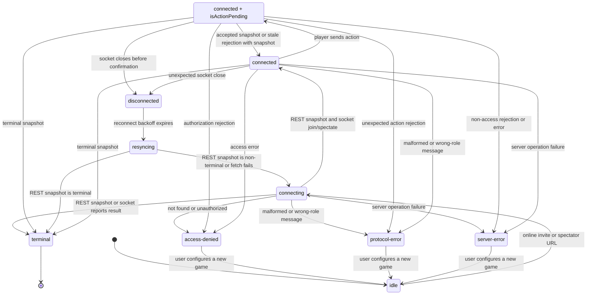

# Online Data Contract

Last refreshed: 2026-06-05

This document records the current contract decisions for online multiplayer. The app still has no production users, so incompatible beta data can be reset instead of migrated.

## Durability Classes

### Disposable Beta Events

`OnlineGameEvent` schema v2 is a private-beta event stream. It is valid for the current single-node beta, but it is not a permanent public contract yet. Creation events are token-free: `game_created` stores `gameId`, setup, optional clock state, and optional public player identities. Version 2 requires `clientActionId` on every `action_accepted` event; because there are no production users, old beta event logs can be reset instead of migrated.

Player credentials live outside the event stream in private server-side credential records keyed by `gameId + seat`. Those records store token hashes, not raw invite tokens. Because the app has no production users, incompatible beta data can be reset rather than migrated.

Unsupported event schema versions must fail replay loudly. Silent partial replay is not allowed.

Accepted action events include a required `clientActionId`. Clients send this id with each action message, and the server persists it on the corresponding `action_accepted` event. For a given game and player, retrying the same `clientActionId` with the same action is idempotent and must not append another action event; if the clock has expired, the retry may still trigger timeout adjudication and return the current terminal snapshot. Reusing the same id with a different action is rejected as `duplicate_action` unless server timeout adjudication has already ended the game. The PostgreSQL store enforces a unique accepted-action index over `game_id + playerColor + clientActionId`.

Visibility changes are also durable `OnlineGameEvent` entries: `visibility_changed` stores `gameId` and `visibility`. Player-controlled visibility is currently limited to `public` and `unlisted`; `private` remains reserved until active spectator sockets can be reauthorized or disconnected. Visibility events do not carry or advance a gameplay version. Room replay validates that the game exists and then ignores these events, while summary projection updates `visibility`, `updatedAt`, and `lastEventId`.

## Online Protocol Envelope

The current WebSocket and REST snapshot protocol is version 1. Every WebSocket client message, WebSocket server message, and REST body that contains a snapshot must include:

- `protocolVersion: 1`

Version 1 WebSocket client messages are `join`, `spectate`, `action`, and `ping`. Version 1 WebSocket server messages are `joined`, `spectating`, `snapshot`, `rejected`, `error`, and `pong`.

`rejected` is action-scoped. It is only valid as the response to a player `action` message and must include the rejected action's `clientActionId`. Generic player, spectator, validation, authorization, persistence, and heartbeat failures use `error` instead. A spectator connection receiving `rejected` treats it as a protocol error because spectators never submit actions.

When a player receives `rejected` with a snapshot, the client applies the authoritative snapshot if it is newer, same-version fresher, or terminal. `stale_action` keeps the connection live and is presented as a resync outcome: the position has been updated from the server and the player may try again. `game_over` with a terminal snapshot moves the client to terminal and stops reconnecting. A late `rejected` frame for an action already settled by a newer broadcast is tolerated so same-player multi-tab races do not turn into protocol errors.

Because the app has no production users, old beta clients are not supported. Missing or unsupported protocol versions are rejected with a controlled `bad_request` error instead of being downgraded or guessed. REST snapshot reads also reject unversioned snapshot envelopes on the client before applying the snapshot.

## Client State Machine

Player and spectator hooks expose the same connection states. Pending action is an orthogonal player-only overlay, exposed as `isActionPending` while the connection status remains `connected`.

| State | Meaning | User action policy | Next transitions |
| --- | --- | --- | --- |
| `idle` | No online game is selected. | Local play is allowed. | `connecting` when an invite/spectator URL is opened. |
| `connecting` | REST snapshot or WebSocket join is in flight. | Online play controls are paused. | `connected`, `terminal`, `access-denied`, `protocol-error`, or `server-error`. |
| `connected` | The socket is live and snapshots are authoritative. | Player actions are allowed only for the side to move and only when no action is pending; spectators remain read-only. | `disconnected`, `terminal`, `server-error`, `access-denied`, or `protocol-error`. |
| `connected` with `isActionPending` | A player action has been sent and the browser is waiting for the server. This is not an `OnlineConnectionStatus`; it is a player-only overlay on `connected`. | Board clicks, pass, promotion, and resign are paused; the badge says `Waiting for server`. | A newer/terminal snapshot, matching `rejected`, `error`, or socket close clears the pending action. |
| `disconnected` | The live socket closed unexpectedly. | Online play controls are paused. | `resyncing` after reconnect backoff. |
| `resyncing` | The client is pulling a REST snapshot before reconnecting. | Online play controls are paused. | `connecting` for non-terminal snapshots or after a failed fetch attempt, and `terminal` for terminal snapshots. |
| `terminal` | The authoritative game result is known. | Play controls are disabled; analysis/new-game actions may be offered. | No automatic reconnect. |
| `access-denied` | The game or token is invalid or unavailable. | Show recovery actions such as `Configure New Game`. | User leaves the failed online URL or opens a valid invite. |
| `protocol-error` | The server sent malformed or wrong-role data. | Stop reconnecting; require reload/new game. | User leaves the failed online URL or reloads after a fixed deploy. |
| `server-error` | The server reported a non-access operational failure. | Stop reconnecting and show recovery actions. | User leaves the failed online URL or retries after server recovery. |

### Durable Public Read Model

`OnlineGameSummary` schema v3 is the public read-model boundary for lobby/archive-style features. It is token-free, rebuildable from the event log, and safe to return from unauthenticated public listing endpoints when `visibility === "public"`.

Summary payloads must include:

- `schemaVersion`
- `rulesetVersion`
- lifecycle timestamps and version
- `status`, `visibility`, and `archiveState`
- token-free participants and result
- `livePreview`: side to move, turn phase, move count, optional last move, optional clock basis, bounded board preview, and optional response-only live metadata
- `lastEventId`

For completed summaries, `endedAt` is the timestamp of the terminal gameplay event: resignation,
timeout adjudication, monarch capture, castle control, or victory-points completion. Later
visibility changes may update `updatedAt` and `lastEventId`, but they must not move `endedAt`.

`livePreview.spectatorCount` is response-only presence metadata. It is allowed only on active summaries, is omitted when the current count is zero or unknown, and must not be stored as durable archive/history data. In the current single-process deployment it is calculated from connected spectator WebSockets on the serving Node process; a future multi-instance deployment needs shared presence/pub-sub before the number can be global across all servers.

`livePreview.clock.serverNow` is also response-only live metadata. It is added only to active timed summaries so clients can estimate the displayed remaining time at the moment the directory or summary response was produced. Stored/materialized summaries keep only the clock basis: `timeControl`, `remainingMs`, `activeColor`, `runningSince`, and optional `flag`. `serverNow` must be stripped before validation for persistence or summary rebuilds, and archived summaries must not include it because their clocks are no longer running.

Public directory list responses wrap summaries in schema v1:

- `schemaVersion: 1`
- `games: OnlineGameSummary[]`
- optional `nextCursor`

`GET /api/online/games` accepts `state=active|archived|all`, `limit=1..100`, an opaque `cursor`, `clock=timed|casual`, `rating=casual|rated`, `result=white|black|resignation|timeout|castle_control|victory_points|monarch_captured`, and `q=<search>`. Search values are normalized to 1-80 visible characters. It returns only public summaries. State, clock, rating, result, and search filters are applied before cursor/limit pagination, so a filtered archive page does not depend on which unfiltered page was loaded first. Missing legacy `ratingMode` fields are treated as casual for filtering. Result filters match completed summaries only; active games without a result do not match a result filter. Search matches visible or derived summary text such as game id, registered display names, White/Black fallbacks, status, result labels, rating labels, side to move, turn phase, and last-move notation; it must not search raw anonymous/session/registered ids, credentials, spectator counts, or full board JSON. Token/auth/credential/api-key-looking query parameters or values are rejected instead of ignored, and public directory reads are lightly rate limited. `GET /api/online/games/:gameId/summary` returns one public summary or the same not-found shape for missing, private, or unlisted games.

Directory ordering is by recent public activity: `updatedAt DESC`, then `gameId ASC`. Cursors are opaque keyset cursors over that ordering; clients must not parse them or treat them as durable identifiers. Cursor payloads reject malformed or secret-looking game ids.

### Local Recent Replay Boundary

No-account recent online replays are a browser convenience, not durable account history and not an authorization mechanism. The local record stores only a game id, last-seen timestamp, player/spectator role, optional player seat, and active/complete status. For unlisted games, that game id is still a local replay locator because the current spectator policy allows anyone who knows the random id to view the game. It is not a bearer token, but it should not be treated as harmless public-history data. Local recent records must not store bearer tokens, challenge tokens, raw invite URLs, cookies, session ids, or spectator URLs.

Opening a recent replay must still go through the server's spectator snapshot policy. Public and unlisted games can be replayed only if that token-free spectator path is allowed; private games need a future authenticated replay endpoint or a token-safe credential design.

Signed-in player history is server-backed and attached to the account identity. Local recent replays may remain as an anonymous/offline fallback, but they must not be the source of truth for a signed-in user's archive once account UI is wired to the account-history endpoint.

## Identity Primitive

Online summaries support three identity kinds:

- `anonymous`: a generated per-game or temporary identity.
- `session`: a public, non-secret browser/session surrogate that can later back challenges without an account.
- `registered`: an account identity with optional display name.

Game creation events may carry `whiteIdentity` and `blackIdentity`. Accepted challenges and accepted open lobby listings bind those identities into the durable `game_created` event before the game summary is projected, so a rebuild preserves the same participants. Direct-created games use explicit generated anonymous identities for both seats when signed out; when a valid account bearer is present, the server binds that registered account identity to the selected creator seat and generates an anonymous identity for the other seat.

Identity `id` values in public summaries are never authentication secrets. Do not put cookies, bearer tokens, raw private invite tokens, or server auth session ids in `OnlineIdentity.id`. Use a separate private credential table for authentication material.

The PostgreSQL store has a personal-history query that can find public, unlisted, and private summaries for a server-resolved identity. `GET /api/online/account/games` exposes that query only after resolving the account bearer token server-side. It accepts `state`, `limit`, and `cursor`; it must not accept a request-body identity, query identity, browser session id, token-like query parameter, or arbitrary visibility override.

## Account Session Contract

Account v1 is intentionally narrow. It supports display-name and password account creation, password sign-in for additional devices, optional Google OAuth account creation/sign-in when server credentials are configured, bearer-token account sessions, current-account lookup, account-owned game history, active-game rejoin, current-session revocation, token-free session listing, sign-out-everywhere account-session revocation, and account deletion. It does not yet include email/password recovery, non-Google OAuth providers, roles, moderation, password reset, or historical game-record anonymization. Account social profiles and public rating summaries are covered by the social/rating contracts below.

Routes:

- `POST /api/online/accounts`: accepts `{ displayName, password }`, normalizes visible whitespace, enforces a case-insensitive unique display name, creates an account id and session id, stores a password hash plus the session token hash, and returns `{ protocolVersion, account, session: { sessionId, token } }`. The raw password and raw session token must not be stored in public summaries or logs; the raw session token is returned once to the client.
- `POST /api/online/account/session`: accepts `{ displayName, password }`, verifies the password hash server-side, creates an additional account session, and returns `{ protocolVersion, account, session: { sessionId, token } }`. Failed credentials return `unauthorized` without revealing whether the display name or password was wrong.
- `GET /api/online/account/oauth/providers`: returns configured account OAuth providers as token-free public capability rows. Google is returned as `{ provider: "google", enabled, startUrl? }`; `startUrl` is present only when both the Google client id and client secret are configured server-side.
- `GET /api/online/account/oauth/google/start`: when Google OAuth is configured, creates a short-lived signed `state`, stores the nonce in an HttpOnly SameSite=Lax callback cookie, and redirects to Google's authorization endpoint for `openid email profile`. It does not put account session tokens in the URL.
- `GET /api/online/account/oauth/google/callback`: validates the signed state, callback cookie nonce, Google token exchange response, Google ID-token signature, and ID-token claims before creating or reusing the account linked to the Google `sub`. The callback creates the same local account bearer-session shape as password sign-in and returns a no-store HTML handoff that writes that account session to the browser's existing account-session local storage key. The raw Google code, account bearer token, provider subject, and Google client secret must not appear in public summaries, game events, challenge events, open-seek summaries, local recent replay records, logs, exported game files, or URLs.
- `GET /api/online/account/me`: requires `Authorization: Bearer <account-session-token>` and returns `{ protocolVersion, account }`.
- `DELETE /api/online/account/session`: requires `Authorization: Bearer <account-session-token>`, revokes the current account session token hash, and returns `{ protocolVersion, revoked: true }`. If the bearer cannot be resolved or the authenticated session cannot be revoked, the route returns an error response rather than a successful `revoked: false` response. It only affects the current account session, not game seat credentials, challenge tokens, open-seek creator tokens, other account sessions, or the account record.
- `GET /api/online/account/sessions`: requires `Authorization: Bearer <account-session-token>` and returns `{ protocolVersion, sessions }`, where each session row includes only `sessionId`, `createdAt`, `lastUsedAt`, and `current`. It must not return raw tokens, token hashes, cookies, user agent strings, IP addresses, or game credentials.
- `DELETE /api/online/account/sessions`: requires `Authorization: Bearer <account-session-token>`, revokes every server-side account session for the authenticated account, and returns `{ protocolVersion, revokedSessions }` with a positive count. If the bearer cannot be resolved or no account sessions are revoked after authentication, the route returns an error response instead of a successful zero-count response. It does not revoke game seat credentials, challenge tokens, open-seek creator tokens, or the account record.
- `DELETE /api/online/account`: requires `Authorization: Bearer <account-session-token>`, deletes the authenticated account record, and returns `{ protocolVersion, deleted: true }`. Deleting the account also removes all account sessions through the account-session storage relationship. If the bearer cannot be resolved, deletion races after authentication, or persistence fails, the route returns an error response rather than a successful `deleted: false` response. It does not revoke game seat credentials, challenge tokens, or open-seek creator tokens.
- `GET /api/online/account/games?state=active|archived|all&limit=...&cursor=...`: requires the account bearer token and returns `OnlineGameDirectoryResponse` rows whose participants include the server-resolved account identity. It may include private and unlisted rows for that account.
- `GET /api/online/account/games/head-to-head/:displayName?limit=...&cursor=...`: requires the account bearer token and returns completed archived `OnlineGameDirectoryResponse` rows whose participants include the server-resolved account identity and a different-seat registered opponent with the exact normalized display name. It filters before pagination in the personal-history query, does not look up or expose the target profile, and returns an empty list when the authenticated viewer has no authorized pair history for that name.
- `POST /api/online/account/games/:gameId/rejoin`: requires `Authorization: Bearer <account-session-token>`, loads the canonical game summary, verifies the account identity is one active participant, rejects completed games, and returns `{ protocolVersion, gameInvite }` with a fresh raw seat token for that account's own side. The returned `gameInvite.url` must be token-free. The fresh token is stored server-side only as an additional seat credential hash, not as an event payload or public summary field.

Account sessions are independent from game player tokens, challenge tokens, and open-seek creator tokens. A game/challenge bearer token authorizes seat-specific game access; an account bearer token identifies the signed-in user for account-owned operations and history. Do not use one kind of bearer token as the other.

Account session token hashes must be unique in storage so one bearer token maps to at most one account session. Raw account session tokens are never stored.

Google OAuth account links are private authentication records keyed by provider and provider subject. Public account identities continue to use the local account id and display name only. OAuth-created accounts may have no password hash; password sign-in must not succeed for those accounts unless a future explicit password-setup flow is added. Google display names are only candidates for the local display name; if the preferred candidate is already reserved, the server chooses another valid candidate and keeps display-name reservation semantics unchanged.

Game seat credentials can have more than one valid hash per seat. The primary `online_game_credentials` row preserves the original invite token hash, while `online_game_additional_credentials` stores account-authorized rejoin token hashes. Rejoin must add a credential alias instead of replacing the original credential, so existing invite/session recovery keeps working. Additional rejoin credential aliases are capped at five per game seat; adding a sixth prunes the oldest additional alias for that same game and seat while preserving the primary invite credential. Additional credential hashes are still private authentication data and must not appear in URLs, summaries, event payloads, logs, local recent replay records, or exported game files.

The browser may persist the returned account session token in local storage so a display-name account survives reloads. This local account session is an account bearer credential only: it must not be copied into URLs, public summaries, move history, game events, challenge events, open-seek summaries, local recent replay records, logs, or exported game files. Game seat tokens, challenge tokens, and open-seek creator tokens continue to use their existing credential-specific storage flows and must not be substituted for the account bearer token. Browser sign-out calls `DELETE /api/online/account/session` before discarding the local account session; sign-out-everywhere calls `DELETE /api/online/account/sessions` before discarding it; account deletion calls `DELETE /api/online/account` before discarding it. If revocation or deletion fails, the browser keeps the local session so the player can retry instead of silently leaving a server account/session active. Other open tabs watch the shared account-session storage key and clear stale signed-in UI after a successful sign-out or deletion removes that local session.

Display names are permanently reserved when an account is created. Account deletion removes the sign-in account, account sessions, ordinary social state, private profile access, following relationships, blocks, and privacy settings for that account, but it does not release the display name for reuse. It also does not rewrite durable game events, game summaries, challenge events, open-seek summaries, rating result rows, moderation report display-name snapshots, local replay records, or exported games that already contain the registered display name as part of game history. Historical game rows continue to obey their existing visibility rules: public games may remain in public archive/search, private and unlisted games stay hidden except to still-authorized credentials or registered participants, and local device-only replay locators remain local browser data. This is the account-linked game-history retention policy for the beta account launch. Any future anonymization or erasure of historical game records must be added as an explicit migration/policy change with archive consistency tests, because changing game records after the fact can make replays, ratings, moderation evidence, and shared archives misleading.

When an account bearer is present on safe creation paths, the server uses the registered account identity instead of trusting a browser-supplied anonymous/session id. This currently applies to direct game creation, open seek creation, open seek acceptance, Quick Match, and challenge creation. Direct game creation accepts an optional `creatorSeat` of `w` or `b`, defaulting to `w`; the authenticated account is bound only to that seat, while the other seat remains anonymous until a future join-identity binding exists.

## Account Social Contract

Social v1 is an account-authenticated foundation for exact profile lookup, one-way follows, blocks, privacy settings, privacy-filtered coarse presence, account-to-account challenge targeting, and account-report submission. The visible UI exposes exact lookup, follow/unfollow, block/unblock, report actions from loaded profiles and followed-player rows, following-list refresh, a compact Online now rail for followed players with visible online presence, presence-aware following rows with local pinned followed-player ordering and All/Online filtering, local private notes for followed-player rows, mutual/follows-you labels, friend challenge/watch/direct-invite shortcuts, profile-card watch/direct-invite shortcuts for loaded public live games, visible-history shortcuts from profile/following rows into the Archive search, account-authorized head-to-head summary cards and cursor-loaded pair-history rows for completed account-history rows matching the searched registered opponent, followed-player filters in Lobby/Watch/Archive/account-history rows, profile links from registered player names in game rows, account-game row follow/challenge/same-settings rematch shortcuts for registered opponents, signed-in game-end rematch prompts for registered opponents found through account history, a pending challenge notice with a focus shortcut into the account challenge inbox, a Pending/All account challenge inbox with terminal status history, follow/presence/challenge privacy controls, signed-in followed-only lobby listing creation from the current setup, and a signed-in following-scoped rating leaderboard. Local pinned followed-player ordering and private notes are client-side account-scoped preferences; they do not create server follow edges, expose internal ids, alter social visibility, or enter account/social API payloads. Local private notes are removed when the followed player is unfollowed or blocked from the visible UI. Visible-history shortcuts only prefill the existing Archive search with a registered display name and therefore show account-owned/private-visible rows and public rows already authorized for the viewer; they do not add a public profile history API, raw ids, or hidden game access. Head-to-head cards and rows prefer the authenticated `GET /api/online/account/games/head-to-head/:displayName` response and fall back to the already loaded account archive in older clients; they count completed archived rows against the exact registered opponent display name and do not make hidden games visible to other accounts. Direct-invite shortcuts create the existing targeted account challenge, open the normal challenge page, and copy the challenged URL locally; the raw challenged challenge token goes only to the Clipboard API and the existing challenge share-link state, not to social profile/follow payloads or account-history summaries. Account challenge creation rejects a second pending challenge from the same authenticated challenger to the same challenged account, and it applies a server-side 60-second same-pair cooldown after declined, cancelled, or expired targeted challenges; accepted challenges do not trigger this cooldown, so quick rematches remain possible. This pair check runs only after normal target authorization succeeds and returns the existing `rate_limited` rejection shape, so it does not reveal hidden targets or expose raw account ids. Account challenge directory and account-token accept/decline/cancel routes also re-check the current block relationship between registered challenge participants; if either side has blocked the other, the challenge is omitted from authenticated inboxes and account-token actions return `not_found`. A successful block also terminates pending targeted challenges between the blocker and blocked account when possible: the blocker declines challenges where they were challenged and cancels challenges where they were the challenger. Direct bearer-token challenge links keep their existing token-based behavior and are governed by the separate challenge-token contract, so token holders may still see the resulting terminal challenge summary. Game-end rematch prompts resolve the opponent from the authenticated account game-history response and create the same unlisted account challenge from the completed snapshot setup; they do not add a separate rematch-request record or expose hidden account ids. The pending challenge notice is derived only from the authenticated account challenge list response and links back to the same inbox rows; it does not create push delivery, reveal challenges to other viewers, or expose hidden challenger ids. Account-game row opponent shortcuts are derived from token-free registered participant display names in account-owned summaries; completed account-game row rematches call `GET /api/online/account/games/:gameId/snapshot` with the viewer's account bearer, require the viewer to be a registered participant in the saved summary, return `not_found` for nonparticipants, and reuse the source game setup when creating the targeted challenge. This endpoint returns an authoritative snapshot without game seat tokens and does not make private games visible through the public spectator route. Account reports now feed a protected admin queue with status transitions and audit entries, but they still do not add adjudication policies, appeals, sanctions, broader notifications, private messages, public profile text, or explicit invite-list lobby listings. Public and following-scoped rating leaders are governed by the separate rating contract below.

Open seek summaries carry `visibility?: "public" | "followed"`, with missing legacy values normalized to `public`. `public` listings are visible to anonymous viewers and signed-in accounts. `followed` listings require a registered creator and are visible only to the creator and to accounts the creator follows/trusts; incoming followers do not gain access unless the creator follows them back. The server applies this access rule before public lobby pagination whenever it controls the full directory scan, filters injected store pages defensively for quick-match candidates, and returns `not_found` when an unauthorized viewer tries to accept a hidden followed-only listing. `GET /api/online/seeks` accepts `state=open`, `limit=1..100`, an opaque `cursor`, `creatorSeat=w|b|random`, `clock=timed|casual`, `vp=enabled|disabled`, and `rating=casual|rated`, plus an optional account bearer so signed-in viewers can see followed-only listings authorized for them. These filters are applied before cursor/limit pagination, and missing legacy `setup.ratingMode` values are treated as casual. Quick Match respects followed-only visibility while scanning candidates, but its fallback listing remains public unless the caller explicitly creates a followed-only seek.

Every social route requires `Authorization: Bearer <account-session-token>`. The server resolves the viewer account from that bearer; clients cannot provide viewer account ids in request bodies. Profile links in visible game rows use the same exact display-name profile endpoint and do not expose raw account ids. Profile and follow-list responses expose display names, optional public rating summaries, privacy-filtered coarse presence, and relationship booleans only. Public rating summaries may include only `{ schemaVersion, rating, display, provisional, games, updatedAt }`; they must not expose rating engine ids, deviation, volatility, raw account ids, or rating-result rows. Relationship booleans currently include `self`, `following`, `followedBy`, and `blocked`. Account-report responses expose only `{ schemaVersion, targetDisplayName, reason, createdAt }`; they do not echo report details. Social responses must not expose raw account ids, account identities, session ids, bearer tokens, token hashes, game seat tokens, challenge tokens, open-seek creator tokens, or internal database keys.

Social routes:

- `GET /api/online/profiles/:displayName`: exact display-name lookup for the authenticated viewer. If the target does not exist or has blocked the viewer, the route returns `not_found` rather than exposing private relationship state.
- `GET /api/online/account/follows`: returns the authenticated viewer's following list as token-free public profiles. Accounts blocked by either side are omitted.
- `PUT /api/online/account/follows/:displayName`: follows an exact display name. The route rejects self-follows, missing targets, blocked relationships, and targets whose follow privacy is `nobody`. Repeating the same follow is idempotent.
- `DELETE /api/online/account/follows/:displayName`: removes a follow edge and returns the current target profile when visible.
- `PUT /api/online/account/blocks/:displayName`: blocks an exact display name. Blocking is idempotent, rejects self-blocks, removes follow edges in both directions, and best-effort terminates pending targeted challenges between the two accounts.
- `DELETE /api/online/account/blocks/:displayName`: removes the viewer's block edge and returns the current target profile when visible.
- `POST /api/online/account/reports/:displayName`: submits a moderation report for an exact display name. The body accepts `{ reason, details? }`, where `reason` is one of `abuse`, `cheating`, `spam`, `impersonation`, or `other`, and `details` is normalized text up to 1000 characters. Report bodies must not contain token/auth/session/credential-looking material. Self-reports return `bad_request`; missing targets and targets that have blocked the reporter return `not_found`. The response is sanitized and does not expose report ids, account ids, reporter details, target account ids, or the submitted details text.
- `GET /api/online/admin/reports?status=open|resolved|dismissed&limit=1..100`: returns the newest moderation reports for operators only when `CASTLES_ADMIN_BEARER_TOKEN` is configured and the request has `Authorization: Bearer <admin-token>`. Missing, disabled, or wrong admin bearer access returns the same hidden `not_found` shape. The route is no-store, defaults `status` to `open`, defaults `limit` to 50, returns `{ protocolVersion, schemaVersion: 2, reports }`, and exposes report id, reporter/target display-name snapshots, reason, details, status, latest moderator note, created/updated timestamps, and nullable `reviewedAt`. It must not expose raw account ids, session ids, bearer tokens, token hashes, database keys, challenge tokens, open-seek tokens, or game credentials.
- `PATCH /api/online/admin/reports/:reportId`: updates a report status for operators only behind the same admin bearer gate. The body accepts `{ status, note? }`, where `status` is `open`, `resolved`, or `dismissed` and `note` is normalized text up to 1000 characters. Notes must not contain token/auth/session/credential-looking material. Missing reports return `not_found`; setting the same status returns `not_allowed` without appending a duplicate audit entry. Successful transitions return `{ protocolVersion, schemaVersion: 2, report, audit }`, where `audit` includes audit id, report id, `status_changed`, actor `admin`, previous/next status, normalized note, and timestamp. The audit payload must not expose raw account ids, session ids, bearer tokens, token hashes, challenge tokens, open-seek tokens, game credentials, or admin bearer material.
- `GET /api/online/admin/reports/:reportId/audits?limit=1..100`: returns newest-first status-transition audit entries for one report behind the same hidden admin bearer gate. The route is no-store, defaults `limit` to 50, returns `{ protocolVersion, schemaVersion: 2, reportId, audits }`, returns `not_found` for missing reports, and returns an empty audit list for existing reports without transitions. Audit rows expose only audit id, report id, `status_changed`, actor `admin`, previous/next status, normalized note, and timestamp; they must not expose raw account ids, session ids, bearer tokens, token hashes, challenge tokens, open-seek tokens, game credentials, or admin bearer material.
- `GET /api/online/account/privacy`: returns privacy settings. Missing persisted settings use defaults.
- `PATCH /api/online/account/privacy`: accepts only `followPolicy`, `presencePolicy`, and `challengePolicy` fields.

Account challenge lists support `state=pending` and `state=all`. Pending lists are the default actionable inbox view; All lists include accepted, declined, cancelled, and expired terminal summaries for status history. Terminal challenge rows are display-only in the visible UI and must not expose accept, decline, or cancel actions.

Privacy v1 defaults are `followPolicy: "everyone"`, `presencePolicy: "followed"`, and `challengePolicy: "followed"`. `followed` means accounts the user has chosen to follow/trust, not arbitrary accounts that follow the user. The visible UI exposes all three privacy settings. Follow creation, profile/follow-list presence visibility, followed-only lobby visibility, and account challenge target resolution use these policies server-side. Future archive visibility must preserve this directionality and must not treat incoming followers as trusted friends.

If an unfollow, block, or unblock request names a real account that is hidden because that account blocks the viewer, the server may still apply the viewer's cleanup/block mutation, but the response must stay hidden and return `not_found` instead of a profile.

PostgreSQL persists social state in `online_account_privacy_settings`, `online_account_follows`, `online_account_blocks`, `online_account_reports`, and `online_account_report_audit`. Privacy, follow, and block rows reference `online_accounts` with `ON DELETE CASCADE`; report rows preserve reporter and target display-name snapshots, keep the current moderation status, latest moderator note, and nullable review timestamp, and use nullable account references so moderation records remain readable after account deletion. Report-audit rows reference the report id, preserve status transitions, and are removed only if the report record itself is deleted. `online_account_display_names` remains a permanent reservation registry. Account deletion removes ordinary social state but still does not release the display name. Follow, unfollow, block, and unblock mutations must serialize the affected account pair inside the transaction, so a block cannot race with a follow and leave a stale trust edge behind.

## Rating Contract

Rating v1 is a modular rating-engine foundation with a restricted live write path for completed rated PostgreSQL games. The default engine is `glicko2-beta-v1`, a Lichess-inspired Glicko-2 baseline unless Castles develops a stronger game-specific reason to switch. A rating record has schema version 1, durable engine id, rating, deviation, volatility, game count, and optional update timestamp. New account ratings start at 1500 with beta deviation 500 and volatility 0.06; the deviation is intentionally higher than the common 350 unrated default because Castles rules and balance are still in beta, and it should be revisited before public rated play. Ratings whose deviation is above 110 are provisional and should be displayed with a question mark. Pure rating updates can process one rating period with zero or more scored results.

Online setup payloads now carry `ratingMode?: "casual" | "rated"`. The Play setup UI exposes this as a Casual/Rated choice, the Online lobby setup summary shows the selected mode, and direct challenges, lobby listings, followed-only listings, rematches that reuse a rated snapshot, and Quick Match preserve it. Server-created games, challenges, lobby seeks, and quick-match fallback listings normalize missing setup modes to `"casual"`, and setup matching keeps casual and rated requests separate. Public lobby listings and public game directories can be filtered by rating mode; legacy missing values are treated as casual. Public game summaries may carry optional `ratingMode`; missing legacy summary fields are displayed and searched as casual, while new and rebuilt summaries expose the persisted setup mode in lobby, watch, public archive, and account archive rows. Completed games write rating changes only when the persisted setup is rated, the terminal result is inserted through the locked action/timeout transaction, and both durable participants are distinct registered accounts. Casual games, anonymous/session games, and same-account seats do not write rating rows. Rating application is idempotent through `online_rating_results.game_id`, and the result row stores both players' before/after ratings plus the engine id used for the update.

There is still no rating-derived matchmaking. Account profile and follow-list read models expose only public rating summaries when a rating row exists. `GET /api/online/ratings/leaderboard?limit=<1..50>&scope=global|following` is a rate-limited rating-leader read model with default limit 10 and default scope `global`. It returns `{ protocolVersion, schemaVersion: 1, scope, entries }`, where each entry is `{ schemaVersion: 1, displayName, rating }` and `rating` is the same public rating summary shape used by profiles: `{ schemaVersion, rating, display, provisional, games, updatedAt }`. `scope=global` is public. `scope=following` requires the account bearer token and returns only the authenticated account plus followed accounts that are not hidden by either side's block relationship. The route must not expose raw account ids, session ids, engine ids, deviation, volatility, raw rating payloads, or rating-result rows. The server must derive rating participants from durable game participants, persisted rating rows, persisted follow edges, and authenticated account ids, never from browser-supplied display names. Any future non-Glicko-2 engine should be added behind the same rating-engine interface with a documented reason and migration plan instead of replacing the default ad hoc. Side/seat advantage adjustment is intentionally out of scope for Phase 7K because Castles balance is still unsettled; if rated play needs it later, the result contract should add side/seat context behind the engine interface.

## Challenge Lifecycle Contract

`OnlineChallengeEvent` schema v1 is the durable contract for direct challenges. The current private challenge HTTP routes, browser links, and materialized summaries are built on this contract; lobby/open-seek behavior uses separate seek events, summaries, visibility, and accept-policy contracts.

Challenge v1 is direct-only. Open seeks intentionally remain outside challenge events because they use a different accept policy and lobby exposure model.

Challenge event envelope:

- `schemaVersion: 1`
- `eventId`
- `createdAt`

Challenge events:

- `challenge_created`: `challengeId`, `challengerIdentity`, `challengedIdentity`, `challengerSeat`, `visibility`, immutable `setup`, and `expiresAt`.
- `challenge_accepted`: `challengeId`, `acceptedBy`, `acceptedAt`, `gameId`, `whiteIdentity`, and `blackIdentity`.
- `challenge_declined`: `challengeId`, `declinedBy`, and `declinedAt`.
- `challenge_cancelled`: `challengeId`, `cancelledBy`, and `cancelledAt`.
- `challenge_expired`: `challengeId`, `expiredBy: "system"`, and `expiredAt`.

Challenge statuses are `pending`, `accepted`, `declined`, `cancelled`, and `expired`. Challenge visibility is currently `private` or `unlisted`; `public` is reserved for future open-seek/lobby work.

Projection applies events in stream order and validates the lifecycle:

- A challenge can be created once, and event ids must be unique across the projected stream.
- Self-challenges are invalid.
- `expiresAt` must be later than challenge creation.
- Acceptance and decline must be performed by the challenged identity.
- Cancellation must be performed by the challenger identity.
- Expiry is system-only.
- Terminal domain timestamps equal the event envelope `createdAt`.
- Accepted, declined, and cancelled timestamps must be at or after challenge creation and before expiry.
- Expired timestamps must be at or after expiry.
- Any event after a terminal state is invalid.

Accepted challenges persist the resolved seats. If `challengerSeat === "w"`, the challenger must be white and the challenged identity black. If `challengerSeat === "b"`, the challenger must be black and the challenged identity white. If `challengerSeat === "random"`, the accepted event is the durable source of the resolved seats, but the two seats must still be exactly the challenger and challenged identities.

Challenge authorization helpers compare identity by `kind + id`; registered display names are public presentation data and do not affect identity equality. Action helpers for accept, decline, and cancel are intended for server-resolved authenticated identities only. Future endpoints must derive that identity from the server session/account layer, never from a request body field supplied by the browser.

Durable challenge events must not contain bearer secrets. Validation rejects token/credential/session/auth/cookie-like fields recursively, bearer/auth/cookie-looking string values, raw invite URLs, and absolute or relative URL strings with token-bearing query parameters or fragments. As with game summaries, `OnlineIdentity.id` is a public non-secret surrogate; obvious bearer, cookie, session, auth, or token material is invalid.

Challenge setup terms are immutable. Accept endpoints must create the game from the `setup` stored in `challenge_created` and must reject any attempt to accept with different game terms.

### Challenge Persistence

Challenge events are persisted in the append-only `online_challenge_events` table. Challenge summaries are materialized in `online_challenge_summaries` and can be rebuilt from the challenge event stream. Challenge persistence uses its own row-lock table and advisory summary lock, separate from game summary locking, so challenge rebuilds do not block ordinary game action summary refreshes.

Appending a non-accepted challenge event validates and canonicalizes the event first, inserts it, projects the affected challenge summary, and upserts that summary inside one transaction. If summary refresh or projection fails, the event insert rolls back.

Challenge bearer credentials are stored separately from durable events in `online_challenge_credentials`. The table stores token hashes and normalized public identities keyed by `challenge_id + role`; raw challenge tokens are never stored. Challenge creation must go through `appendChallengeCreated` so `challenge_created`, credential rows, and the pending summary are written atomically. The low-level `appendChallengeEvent` path is limited to decline, cancel, and lazy/internal expiry events.

Accepting a challenge uses `acceptChallengeAndCreateGame`, a dedicated atomic store method. It locks the challenge and new game, verifies the challenged role, creates the online game event from the immutable challenge setup, derives white/black game credential hashes from the private challenge credential hashes, appends `challenge_accepted`, and refreshes both game and challenge summaries in one transaction. The original challenger/challenged challenge bearer tokens become the corresponding game bearer tokens after acceptance, which lets either side retrieve only its own game invite later without storing raw game tokens.

Browser challenge links put bearer material in the URL fragment, not the query string: `onlineChallenge` and `challengeRole` are query parameters, while `challengeToken` is a fragment parameter captured into `sessionStorage` and stripped from the visible URL before API calls. Challenge API routes authenticate only with `Authorization: Bearer`; query-token authentication is rejected.

## Visibility And Access

Visibility values:

- `private`: visible to players, a bound challenged user, moderators, and admins.
- `unlisted`: excluded from public lists; current private-beta spectator links are random-id links and can view these games if the id is known.
- `public`: visible in public lists and intended for ordinary spectator access.

Current created games project as `unlisted`. A player can publish or unlist a game through `PATCH /api/online/games/:gameId/visibility`, authorized by the same bearer player token used for snapshots. The route returns `protocolVersion: 1` and a token-free `OnlineGameSummary`; it fails closed if durable persistence is unavailable.

Role names:

- `white`
- `black`
- `spectator`
- `challenged`
- `moderator`
- `admin`

Summary listing and spectator authorization use `src/online/accessPolicy.ts`. Public listing returns only `public` summaries. Spectator access is allowed for `public` and `unlisted` games and denied for `private` games. If the server has a configured summary loader, missing or invalid summary data fails closed with the same public `not_found` response as a missing game. If no summary loader is configured, the current private-link beta keeps its allow-open spectator behavior so local/dev smoke flows still work.

The `challenged` role is provisional until challenge identity binding exists. It must only be assigned after a separate challenge/session/account binding check proves the requester is the bound challenged user. It is not a permission that can be inferred from an unauthenticated HTTP or WebSocket request.

Initial HTTP and WebSocket spectator joins are checked against the shared policy. Existing spectator sockets are not re-authorized on every broadcast. Before any future visibility change can make a game private mid-game, broadcasts must either revalidate spectator sockets or disconnect sockets that no longer satisfy the policy.

Server spectator authorization now prefers `loadGameSummary(gameId)` when the configured store exposes it, falling back to the older low-scale summary scan only in memory/dev configurations.

## Next Contract Changes

1. Add archive detail/search read models if the summary payload stops being enough for richer analysis pages.
2. Expand the account/session ownership layer before reports, moderation, richer notification delivery, and any experimental rating analytics.
3. Revalidate or disconnect spectator sockets before allowing mid-game visibility changes to `private`.
