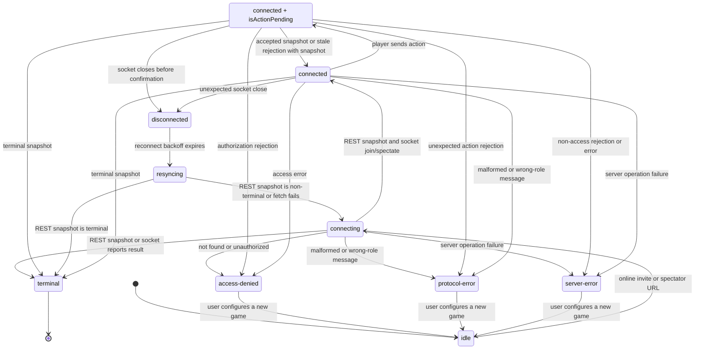

# Online Data Contract

Last refreshed: 2026-06-01

This document records the current contract decisions for online multiplayer. The app still has no production users, so incompatible beta data can be reset instead of migrated.

## Durability Classes

### Disposable Beta Events

`OnlineGameEvent` schema v2 is a private-beta event stream. It is valid for the current single-node beta, but it is not a permanent public contract yet. Creation events are token-free: `game_created` stores only `gameId`, setup, and optional clock state. Version 2 requires `clientActionId` on every `action_accepted` event; because there are no production users, old beta event logs can be reset instead of migrated.

Player credentials live outside the event stream in private server-side credential records keyed by `gameId + seat`. Those records store token hashes, not raw invite tokens. Because the app has no production users, incompatible beta data can be reset rather than migrated.

Unsupported event schema versions must fail replay loudly. Silent partial replay is not allowed.

Accepted action events include a required `clientActionId`. Clients send this id with each action message, and the server persists it on the corresponding `action_accepted` event. For a given game and player, retrying the same `clientActionId` with the same action is idempotent and must not append another action event; if the clock has expired, the retry may still trigger timeout adjudication and return the current terminal snapshot. Reusing the same id with a different action is rejected as `duplicate_action` unless server timeout adjudication has already ended the game. The PostgreSQL store enforces a unique accepted-action index over `game_id + playerColor + clientActionId`.

## Online Protocol Envelope

The current WebSocket and REST snapshot protocol is version 1. Every WebSocket client message, WebSocket server message, and REST body that contains a snapshot must include:

- `protocolVersion: 1`

Version 1 WebSocket client messages are `join`, `spectate`, `action`, and `ping`. Version 1 WebSocket server messages are `joined`, `spectating`, `snapshot`, `rejected`, `error`, and `pong`.

`rejected` is action-scoped. It is only valid as the response to a player `action` message and must include the rejected action's `clientActionId`. Generic player, spectator, validation, authorization, persistence, and heartbeat failures use `error` instead. A spectator connection receiving `rejected` treats it as a protocol error because spectators never submit actions.

When a player receives `rejected` with a snapshot, the client applies the authoritative snapshot if it is newer, same-version fresher, or terminal. `stale_action` keeps the connection live and is presented as a resync outcome: the position has been updated from the server and the player may try again. `game_over` with a terminal snapshot moves the client to terminal and stops reconnecting. A late `rejected` frame for an action already settled by a newer broadcast is tolerated so same-player multi-tab races do not turn into protocol errors.

Because the app has no production users, old beta clients are not supported. Missing or unsupported protocol versions are rejected with a controlled `bad_request` error instead of being downgraded or guessed. REST snapshot reads also reject unversioned snapshot envelopes on the client before applying the snapshot.

## Client State Machine

Player and spectator hooks expose the same connection states. Pending action is an orthogonal player-only overlay, exposed as `isActionPending` while the connection status remains `connected`.

| State | Meaning | User action policy | Next transitions |
| --- | --- | --- | --- |
| `idle` | No online game is selected. | Local play is allowed. | `connecting` when an invite/spectator URL is opened. |
| `connecting` | REST snapshot or WebSocket join is in flight. | Online play controls are paused. | `connected`, `terminal`, `access-denied`, `protocol-error`, or `server-error`. |
| `connected` | The socket is live and snapshots are authoritative. | Player actions are allowed only for the side to move and only when no action is pending; spectators remain read-only. | `disconnected`, `terminal`, `server-error`, `access-denied`, or `protocol-error`. |
| `connected` with `isActionPending` | A player action has been sent and the browser is waiting for the server. This is not an `OnlineConnectionStatus`; it is a player-only overlay on `connected`. | Board clicks, pass, promotion, and resign are paused; the badge says `Waiting for server`. | A newer/terminal snapshot, matching `rejected`, `error`, or socket close clears the pending action. |
| `disconnected` | The live socket closed unexpectedly. | Online play controls are paused. | `resyncing` after reconnect backoff. |
| `resyncing` | The client is pulling a REST snapshot before reconnecting. | Online play controls are paused. | `connecting` for non-terminal snapshots or after a failed fetch attempt, and `terminal` for terminal snapshots. |
| `terminal` | The authoritative game result is known. | Play controls are disabled; analysis/new-game actions may be offered. | No automatic reconnect. |
| `access-denied` | The game or token is invalid or unavailable. | Show recovery actions such as `Configure New Game`. | User leaves the failed online URL or opens a valid invite. |
| `protocol-error` | The server sent malformed or wrong-role data. | Stop reconnecting; require reload/new game. | User leaves the failed online URL or reloads after a fixed deploy. |
| `server-error` | The server reported a non-access operational failure. | Stop reconnecting and show recovery actions. | User leaves the failed online URL or retries after server recovery. |

### Durable Public Read Model

`OnlineGameSummary` schema v1 is the public read-model boundary for lobby/archive-style features. It is token-free, rebuildable from the event log, and safe to return from unauthenticated public listing endpoints when `visibility === "public"`.

Summary payloads must include:

- `schemaVersion`
- `rulesetVersion`
- lifecycle timestamps and version
- `status`, `visibility`, and `archiveState`
- token-free participants and result
- `lastEventId`

## Identity Primitive

Online summaries support three identity kinds:

- `anonymous`: a generated per-game or temporary identity.
- `session`: a public, non-secret browser/session surrogate that can later back challenges without an account.
- `registered`: a future account identity with optional display name.

Current game creation still projects anonymous identities only. Session and registered identities are accepted by the summary validator so the read-model shape does not need to change when those systems arrive.

Identity `id` values in public summaries are never authentication secrets. Do not put cookies, bearer tokens, raw private invite tokens, or server auth session ids in `OnlineIdentity.id`. Use a separate private credential table for authentication material.

## Challenge Lifecycle Contract

`OnlineChallengeEvent` schema v1 is the durable contract for direct challenges. It is intentionally endpoint-free in this slice: no HTTP route, database table, or UI should depend on challenge behavior until the event contract and projection rules are stable.

Challenge v1 is direct-only. Public/open seeks are deferred to a later contract because they need a different accept policy and lobby exposure model.

Challenge event envelope:

- `schemaVersion: 1`
- `eventId`
- `createdAt`

Challenge events:

- `challenge_created`: `challengeId`, `challengerIdentity`, `challengedIdentity`, `challengerSeat`, `visibility`, and `expiresAt`.
- `challenge_accepted`: `challengeId`, `acceptedBy`, `acceptedAt`, `gameId`, `whiteIdentity`, and `blackIdentity`.
- `challenge_declined`: `challengeId`, `declinedBy`, and `declinedAt`.
- `challenge_cancelled`: `challengeId`, `cancelledBy`, and `cancelledAt`.
- `challenge_expired`: `challengeId`, `expiredBy: "system"`, and `expiredAt`.

Challenge statuses are `pending`, `accepted`, `declined`, `cancelled`, and `expired`. Challenge visibility is currently `private` or `unlisted`; `public` is reserved for future open-seek/lobby work.

Projection applies events in stream order and validates the lifecycle:

- A challenge can be created once, and event ids must be unique across the projected stream.
- Self-challenges are invalid.
- `expiresAt` must be later than challenge creation.
- Acceptance and decline must be performed by the challenged identity.
- Cancellation must be performed by the challenger identity.
- Expiry is system-only.
- Terminal domain timestamps equal the event envelope `createdAt`.
- Accepted, declined, and cancelled timestamps must be at or after challenge creation and before expiry.
- Expired timestamps must be at or after expiry.
- Any event after a terminal state is invalid.

Accepted challenges persist the resolved seats. If `challengerSeat === "w"`, the challenger must be white and the challenged identity black. If `challengerSeat === "b"`, the challenger must be black and the challenged identity white. If `challengerSeat === "random"`, the accepted event is the durable source of the resolved seats, but the two seats must still be exactly the challenger and challenged identities.

Challenge authorization helpers compare identity by `kind + id`; registered display names are public presentation data and do not affect identity equality. Action helpers for accept, decline, and cancel are intended for server-resolved authenticated identities only. Future endpoints must derive that identity from the server session/account layer, never from a request body field supplied by the browser.

Durable challenge events must not contain bearer secrets. Validation rejects token/credential/session/auth/cookie-like fields recursively, bearer/auth/cookie-looking string values, raw invite URLs, and absolute or relative URL strings with token-bearing query parameters or fragments. As with game summaries, `OnlineIdentity.id` is a public non-secret surrogate; obvious bearer, cookie, session, auth, or token material is invalid.

## Visibility And Access

Visibility values:

- `private`: visible to players, a bound challenged user, moderators, and admins.
- `unlisted`: excluded from public lists; current private-beta spectator links are random-id links and can view these games if the id is known.
- `public`: visible in public lists and intended for ordinary spectator access.

Current created games project as `unlisted`. A future `visibility_changed` or challenge/lobby event must be added before real public lobby entries exist.

Role names:

- `white`
- `black`
- `spectator`
- `challenged`
- `moderator`
- `admin`

Summary listing and spectator authorization use `src/online/accessPolicy.ts`. Public listing returns only `public` summaries. Spectator access is allowed for `public` and `unlisted` games and denied for `private` games. If the server has a configured summary loader, missing or invalid summary data fails closed with the same public `not_found` response as a missing game. If no summary loader is configured, the current private-link beta keeps its allow-open spectator behavior so local/dev smoke flows still work.

The `challenged` role is provisional until challenge identity binding exists. It must only be assigned after a separate challenge/session/account binding check proves the requester is the bound challenged user. It is not a permission that can be inferred from an unauthenticated HTTP or WebSocket request.

Initial HTTP and WebSocket spectator joins are checked against the shared policy. Existing spectator sockets are not re-authorized on every broadcast because there are no visibility-change events yet. Before any future `visibility_changed` event can make a game private mid-game, broadcasts must either revalidate spectator sockets or disconnect sockets that no longer satisfy the policy.

For this low-scale foundation slice, server spectator authorization scans `loadGameSummaries()` for the requested game id. A later `loadGameSummary(gameId)` store method can replace that scan when challenge/lobby scale requires it.

## Next Contract Changes

1. Add challenge persistence/endpoints that write `OnlineChallengeEvent` records and create games from accepted challenges.
2. Add durable visibility lifecycle events before public lobby/archive UI can change exposure mid-game.
3. Add a public account/session ownership layer before private challenge authorization.
4. Revalidate or disconnect spectator sockets before allowing mid-game visibility changes.
