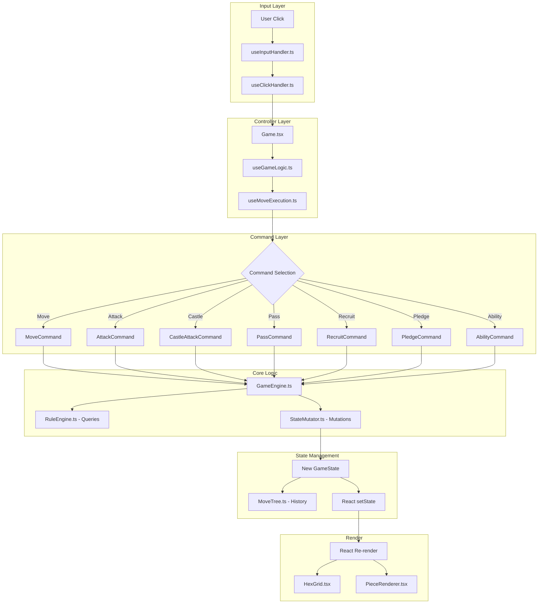
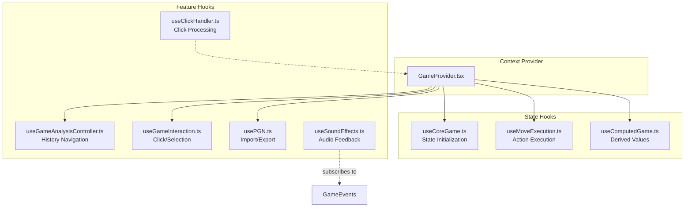

# Castles Architecture Overview

> **Version**: 5.0 (January 2026)  
> **Purpose**: Technical reference for understanding and maintaining the Castles codebase.

---

## Table of Contents

1. [System Overview](#system-overview)
2. [Control Flow](#control-flow)
3. [Core Systems](#core-systems)
4. [Data Layer](#data-layer)
5. [React Hooks](#react-hooks)
6. [Game Serialization (PGN)](#game-serialization-pgn)
7. [Extension Guide](#extension-guide)
8. [File Reference](#file-reference)

---

## System Overview

Castles is a fantasy-themed hexagonal chess variant built with React and TypeScript. The architecture follows a layered design:

```
┌─────────────────────────────────────────────────┐
│                  UI Layer                       │
│   (React Components: Game.tsx, HexGrid.tsx)     │
├─────────────────────────────────────────────────┤
│                 Hook Layer                      │
│   (GameProvider, useMoveExecution, usePGN)      │
├─────────────────────────────────────────────────┤
│               Command Layer                     │
│   (MoveCommand, AttackCommand, RecruitCommand)  │
├─────────────────────────────────────────────────┤
│                Core Logic                       │
│   GameEngine ──► RuleEngine (queries)           │
│              └─► StateMutator (mutations)       │
├─────────────────────────────────────────────────┤
│               Domain Entities                   │
│   (Piece, Hex, Castle, Sanctuary, Board)        │
└─────────────────────────────────────────────────┘
```

### Design Patterns Used

| Pattern | Implementation | Purpose |
|---------|---------------|---------|
| **Facade** | `GameEngine` | Single entry point to game logic |
| **Strategy** | `MoveStrategyRegistry` | Piece-specific movement behaviors |
| **Command** | `Command` classes | Encapsulate game actions |
| **Observer** | `GameEventEmitter` | Decouple logic from side effects |
| **Immutable State** | `Piece.with()` | Safe state transitions |

---

## Control Flow

### User Action → State Update → Render



### Click Handling Priority

[useClickHandler.ts](file:///c:/Users/liaml/Documents/GitHub/Castles/src/hooks/useClickHandler.ts) processes clicks in this order:

1. **Ability Targeting** — If ability active, validate and execute
2. **Pledge Spawn** — If pledging sanctuary, place new piece
3. **Sanctuary Selection** — Enter pledge mode
4. **Engine Delegation** — Normal move/attack/recruit

### Input Handlers

| Input | Handler | Action |
|-------|---------|--------|
| Arrow Keys | `useInputHandler.ts` | History navigation |
| Hex Click | `useClickHandler.ts` | Board interaction |
| Piece Click | `PieceRenderer.tsx` | Selection |
| Pass Button | `ControlPanel.tsx` | Skip phase |
| Escape Key | `useInputHandler.ts` | Clear selection |
| Ability Button | `AbilityBar.tsx` | Enter targeting mode |

---

## Core Systems

### GameEngine (Facade)

[GameEngine.ts](file:///c:/Users/liaml/Documents/GitHub/Castles/src/Classes/Core/GameEngine.ts) provides a unified API for all game operations.

**Responsibilities:**
- Delegates queries to `RuleEngine` (pure functions, read-only)
- Delegates mutations to `StateMutator` (state transitions)
- Holds reference to `Board` for topology checks

```typescript
class GameEngine {
  constructor(public board: Board) {}
  
  // Queries (delegates to RuleEngine)
  getTurnPhase(turnCounter: number): TurnPhase
  getCurrentPlayer(turnCounter: number): Color
  getLegalMoves(state: GameState, piece: Piece): Hex[]
  getLegalAttacks(state: GameState, piece: Piece): Hex[]
  
  // Mutations (delegates to StateMutator)
  applyMove(state: GameState, piece: Piece, targetHex: Hex): GameState
  applyAttack(state: GameState, attacker: Piece, targetHex: Hex): GameState
  recruitPiece(state: GameState, castle: Castle, hex: Hex): GameState
}
```

### RuleEngine (Queries)

[RuleEngine.ts](file:///c:/Users/liaml/Documents/GitHub/Castles/src/Classes/Systems/RuleEngine.ts) contains **pure static functions** for game rules.

**Key Methods:**
| Method | Purpose |
|--------|---------|
| `getLegalMoves` | Valid movement hexes for a piece |
| `getLegalAttacks` | Valid attack targets |
| `getBlockedHexSet` | O(1) blocked hex lookups |
| `getRecruitmentHexes` | Valid spawn locations |
| `getTurnCounterIncrement` | Phase transition logic |

### StateMutator (Mutations)

[StateMutator.ts](file:///c:/Users/liaml/Documents/GitHub/Castles/src/Classes/Systems/StateMutator.ts) handles **immutable state transitions**.

Every method takes a `GameState` and returns a **new** `GameState`:

```typescript
class StateMutator {
  static applyMove(state: GameState, piece: Piece, target: Hex, board: Board): GameState
  static applyAttack(state: GameState, attacker: Piece, target: Hex, board: Board): GameState
  static passTurn(state: GameState, board: Board): GameState
  static activateAbility(state: GameState, source: Piece, target: Hex, ability: AbilityType, board: Board): GameState
}
```

### StateValidator

[StateValidator.ts](file:///c:/Users/liaml/Documents/GitHub/Castles/src/Classes/Systems/StateValidator.ts) validates game state invariants.

| Invariant | Method |
|-----------|--------|
| No duplicate positions | `validateNoDuplicatePieces` |
| Pieces on valid hexes | `validatePiecesOnBoard` |
| Castle ownership consistent | `validateCastleOwnership` |
| Turn counter non-negative | `validateTurnCounter` |
| PieceMap synced with array | `validatePieceMapSync` |

**Usage:**
```typescript
// Development mode
StateValidator.assertValid(newState, board);

// Production (logs warnings)
StateValidator.warnIfInvalid(newState, board);
```

---

## Data Layer

### GameState

The complete state of a game at any point:

```typescript
interface GameState {
  pieces: Piece[]           // All pieces on board
  pieceMap: PieceMap        // O(1) lookup by hex
  castles: Castle[]         // Castle positions and ownership
  sanctuaries: Sanctuary[]  // Sanctuary positions
  turnCounter: number       // Encodes player + phase
  movingPiece: Piece | null // Currently selected piece
  history: HistoryEntry[]   // UI display history
  moveHistory: MoveRecord[] // Move notation records
  moveTree: MoveTree        // Tree-based history with variations
  graveyard: Piece[]        // Captured pieces
  phoenixRecords: PhoenixRecord[] // Phoenix respawn tracking
}
```

### Turn Counter Encoding

The turn counter encodes both the current player and phase:

```
turnCounter:  0   1   2   3   4   5   6   7   8   9   10  11  ...
             └─── WHITE ────────┘   └─── BLACK ────────┘   └─ WHITE
Phase:        M   M   A   A   C       M   M   A   A   C       M   M
```

- **M** = Movement (2 moves per turn)
- **A** = Attack (2 attacks per turn)
- **C** = Castles (recruit from controlled castles)

### Domain Entities

| Entity | File | Key Properties |
|--------|------|----------------|
| `Piece` | [Piece.ts](file:///c:/Users/liaml/Documents/GitHub/Castles/src/Classes/Entities/Piece.ts) | `hex`, `color`, `type`, `hasMoved`, `hasAttacked` |
| `Hex` | [Hex.ts](file:///c:/Users/liaml/Documents/GitHub/Castles/src/Classes/Entities/Hex.ts) | `q`, `r`, `s` (cube coordinates) |
| `Castle` | [Castle.ts](file:///c:/Users/liaml/Documents/GitHub/Castles/src/Classes/Entities/Castle.ts) | `hex`, `color`, `owner`, `spawnCounter` |
| `Sanctuary` | [Sanctuary.ts](file:///c:/Users/liaml/Documents/GitHub/Castles/src/Classes/Entities/Sanctuary.ts) | `hex`, `type`, `pledgedBy` |
| `Board` | [Board.ts](file:///c:/Users/liaml/Documents/GitHub/Castles/src/Classes/Core/Board.ts) | `hexSet`, `riverHexes`, topology |

### Data Structures for Performance

| Use Case | Structure | Lookup |
|----------|-----------|--------|
| Piece by hex | `PieceMap` (Map) | O(1) |
| Blocked hexes | `Set<string>` | O(1) |
| Legal moves | `Set<string>` | O(1) |
| Move history | `MoveTree` | O(1) navigation |

---

## React Hooks

### Hook Composition Diagram



### Hook Responsibilities

| Hook | Purpose | Lines |
|------|---------|-------|
| [GameProvider](file:///c:/Users/liaml/Documents/GitHub/Castles/src/contexts/GameProvider.tsx) | Context provider, replaces useGameLogic | 284 |
| [useCoreGame](file:///c:/Users/liaml/Documents/GitHub/Castles/src/hooks/useCoreGame.ts) | State initialization from props | 103 |
| [useComputedGame](file:///c:/Users/liaml/Documents/GitHub/Castles/src/hooks/useComputedGame.ts) | Derived values (turn phase, legal moves) | 140 |
| [useMoveExecution](file:///c:/Users/liaml/Documents/GitHub/Castles/src/hooks/useMoveExecution.ts) | Executes commands, updates state | 251 |
| [useGameAnalysisController](file:///c:/Users/liaml/Documents/GitHub/Castles/src/hooks/useGameAnalysisController.ts) | History navigation & analysis mode | 150 |
| [useGameInteraction](file:///c:/Users/liaml/Documents/GitHub/Castles/src/hooks/useGameInteraction.ts) | Piece selection, click handling | 95 |
| [useClickHandler](file:///c:/Users/liaml/Documents/GitHub/Castles/src/hooks/useClickHandler.ts) | Processes board clicks | 172 |
| [useInputController](file:///c:/Users/liaml/Documents/GitHub/Castles/src/hooks/useInputController.ts) | Command resolution from clicks | 80 |
| [usePGN](file:///c:/Users/liaml/Documents/GitHub/Castles/src/hooks/usePGN.ts) | Import/export game state | 90 |
| [useSoundEffects](file:///c:/Users/liaml/Documents/GitHub/Castles/src/hooks/useSoundEffects.ts) | Audio feedback via event subscription | 90 |
| [useAIOpponent](file:///c:/Users/liaml/Documents/GitHub/Castles/src/hooks/useAIOpponent.ts) | AI opponent integration | 125 |
| [usePersistence](file:///c:/Users/liaml/Documents/GitHub/Castles/src/hooks/usePersistence.ts) | Game save/load | 80 |

---

## Game Serialization (PGN)

### Architecture

```
PGNService.ts (Facade)
├── PGNGenerator.ts (Export)
├── PGNImporter.ts (Import + Hydration)
├── PGNParser.ts (Low-level parsing)
└── PGNTypes.ts (Type definitions)
```

### Export Flow

```
getPGN() in usePGN.ts
    → PGNService.generatePGN(moveTree, initialPieces, board, sanctuaries)
    → PGNGenerator
        1. Read MoveTree.rootNode.snapshot.pieces (starting position)
        2. Compress to CompactSetup format
        3. Base64-encode → [CustomSetup "..."] tag
        4. Recursive tree traversal for moves + variations
        5. Return complete PGN string
```

### Import Flow

```
loadPGN() in usePGN.ts
    → PGNService.parsePGN(pgnString)
    → PGNImporter:
        1. parsePGN() - Extract CustomSetup tag, parse move tokens
        2. PGNParser.parseToTree() - Build skeletal MoveTree
        3. decompressSetup() - Base64 → BoardConfig, Pieces, Castles
        4. reconstructState() - Create domain objects
        5. hydrateRecursive() - Replay moves, attach snapshots
        6. Return navigable GameState with MoveTree
```

### CustomSetup Format

```json
[CustomSetup "base64({
  boardConfig: { nSquares, riverCrossingLength, riverSegmentLength },
  pieces: [{ q, r, s, color, type, flags? }],
  castles: [{ q, r, s, owner, spawnCounter }],
  sanctuaries: [{ q, r, s, type, pledgedBy? }]
})"]
```

---

## Extension Guide

### Adding a New Piece Type

| Step | File | Change |
|------|------|--------|
| 1 | [Constants.ts](file:///c:/Users/liaml/Documents/GitHub/Castles/src/Constants.ts) | Add to `PieceType` enum |
| 2 | [PieceTypeConfig.ts](file:///c:/Users/liaml/Documents/GitHub/Castles/src/Classes/Config/PieceTypeConfig.ts) | Add config: strength, attackType, description |
| 3 | [MoveStrategyRegistry.ts](file:///c:/Users/liaml/Documents/GitHub/Castles/src/Classes/Strategies/MoveStrategyRegistry.ts) | Register movement function |
| 4 | [MoveStrategies.ts](file:///c:/Users/liaml/Documents/GitHub/Castles/src/Classes/Strategies/MoveStrategies.ts) | Implement movement logic |
| 5 | [AttackStrategyRegistry.ts](file:///c:/Users/liaml/Documents/GitHub/Castles/src/Classes/Strategies/AttackStrategyRegistry.ts) | (Optional) Non-standard attacks |
| 6 | `public/images/pieces/` | Add SVG assets |
| 7 | [PieceImages.ts](file:///c:/Users/liaml/Documents/GitHub/Castles/src/components/PieceImages.ts) | Map image imports |

**Note**: Core files (`Piece.ts`, `GameEngine.ts`, `RuleEngine.ts`) require **no modification**.

### Adding a New Ability

| Step | File | Change |
|------|------|--------|
| 1 | [Constants.ts](file:///c:/Users/liaml/Documents/GitHub/Castles/src/Constants.ts) | Add to `AbilityType` enum |
| 2 | [AbilityConfig.ts](file:///c:/Users/liaml/Documents/GitHub/Castles/src/Classes/Config/AbilityConfig.ts) | Add config: range, description, pieceTypes |
| 3 | [AbilitySystem.ts](file:///c:/Users/liaml/Documents/GitHub/Castles/src/Classes/Systems/AbilitySystem.ts) | Add validation logic |
| 4 | [StateMutator.ts](file:///c:/Users/liaml/Documents/GitHub/Castles/src/Classes/Systems/StateMutator.ts) | Add execution logic in `activateAbility()` |

### Adding a New Event

| Step | File | Change |
|------|------|--------|
| 1 | [GameEvents.ts](file:///c:/Users/liaml/Documents/GitHub/Castles/src/Classes/Events/GameEvents.ts) | Define event interface |
| 2 | Command class | Emit event after execution |
| 3 | Subscriber hook | Subscribe to event |

---

## File Reference

### Core Architecture

| File | Purpose | Lines |
|------|---------|-------|
| [GameEngine.ts](file:///c:/Users/liaml/Documents/GitHub/Castles/src/Classes/Core/GameEngine.ts) | Facade for game logic | 235 |
| [RuleEngine.ts](file:///c:/Users/liaml/Documents/GitHub/Castles/src/Classes/Systems/RuleEngine.ts) | Pure query functions | 326 |
| [StateMutator.ts](file:///c:/Users/liaml/Documents/GitHub/Castles/src/Classes/Systems/StateMutator.ts) | State transitions | 427 |
| [AbilitySystem.ts](file:///c:/Users/liaml/Documents/GitHub/Castles/src/Classes/Systems/AbilitySystem.ts) | Ability validation | 280 |
| [Board.ts](file:///c:/Users/liaml/Documents/GitHub/Castles/src/Classes/Core/Board.ts) | Hexagonal grid topology | 217 |
| [MoveTree.ts](file:///c:/Users/liaml/Documents/GitHub/Castles/src/Classes/Core/MoveTree.ts) | Move history tree | 256 |

### Commands

| File | Action |
|------|--------|
| [MoveCommand.ts](file:///c:/Users/liaml/Documents/GitHub/Castles/src/Classes/Commands/MoveCommand.ts) | Piece movement |
| [AttackCommand.ts](file:///c:/Users/liaml/Documents/GitHub/Castles/src/Classes/Commands/AttackCommands.ts) | Combat |
| [CastleAttackCommand.ts](file:///c:/Users/liaml/Documents/GitHub/Castles/src/Classes/Commands/AttackCommands.ts) | Castle capture |
| [PassCommand.ts](file:///c:/Users/liaml/Documents/GitHub/Castles/src/Classes/Commands/PassCommand.ts) | Skip phase |
| [RecruitCommand.ts](file:///c:/Users/liaml/Documents/GitHub/Castles/src/Classes/Commands/RecruitCommand.ts) | Spawn piece |
| [PledgeCommand.ts](file:///c:/Users/liaml/Documents/GitHub/Castles/src/Classes/Commands/PledgeCommand.ts) | Sanctuary pledging |
| [AbilityCommand.ts](file:///c:/Users/liaml/Documents/GitHub/Castles/src/Classes/Commands/AbilityCommand.ts) | Special abilities |

### Configuration

| File | Purpose |
|------|---------|
| [Constants.ts](file:///c:/Users/liaml/Documents/GitHub/Castles/src/Constants.ts) | Enums, constants, types |
| [PieceTypeConfig.ts](file:///c:/Users/liaml/Documents/GitHub/Castles/src/Classes/Config/PieceTypeConfig.ts) | Piece metadata |
| [AbilityConfig.ts](file:///c:/Users/liaml/Documents/GitHub/Castles/src/Classes/Config/AbilityConfig.ts) | Ability metadata |

### Events

| Event | When Emitted | Payload |
|-------|--------------|---------|
| `MOVE_MADE` | After piece movement | `{ piece, from, to }` |
| `ATTACK_RESOLVED` | After combat | `{ attacker, defender, result }` |
| `CASTLE_CAPTURED` | Castle changes owner | `{ castle, newOwner }` |
| `PIECE_RECRUITED` | New piece spawned | `{ piece, castle }` |
| `TURN_CHANGED` | Phase/player changes | `{ phase, player }` |
| `PIECE_DESTROYED` | Combat death | `{ piece }` |
| `SANCTUARY_PLEDGED` | Pledge action | `{ sanctuary, piece }` |
| `ABILITY_ACTIVATED` | Special ability | `{ ability, source, target }` |
| `GAME_ENDED` | Game over | `{ winner, reason }` |

### Test Files (25 total)

| Category | Files |
|----------|-------|
| Core Logic | `GameEngine.test.ts`, `Hex.test.ts`, `WinConditions.test.ts` |
| Special Pieces | `Wolf.test.ts`, `Phoenix.test.ts`, `Wizard.test.ts`, `Necromancer.test.ts`, `Healer.test.ts` |
| Sanctuaries | `Sanctuary.test.ts`, `SanctuaryGenerator.test.ts`, `Pledge.test.ts` |
| PGN | `PGNService.test.ts`, `PGNTreeStructure.test.ts`, `PGNVariations.test.ts`, + 3 more |
| Systems | `StateValidator.test.ts` |
| Hooks | `useGameLogicVariants.test.ts`, `useGameLogicVariations.test.ts`, `HistoryDuplication.test.ts` |

---

## Changelog

| Version | Date | Changes |
|---------|------|---------|
| 5.0 | 2026-01-25 | Replaced useGameLogic with GameContext/GameProvider pattern, added new hooks |
| 4.0 | 2025-12-25 | Restructured as technical reference (removed evaluative content) |
| 3.2 | 2025-12-25 | Added StateValidator section, hook composition diagram |
| 3.1 | 2025-12-25 | AbilityConfig, AbilitySystem, hook consolidation |
| 3.0 | 2025-12-25 | Comprehensive audit with 6-dimension review |
