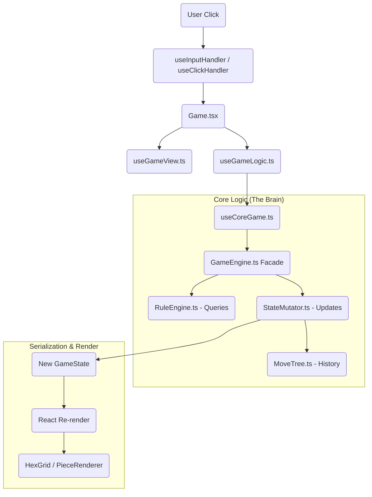

# Analysis Mode & PGN Architecture

## Overview

This document describes how Analysis Mode, Variant Creation, and PGN Import/Export work together.

---

## 1. Control Flow Mapping

### User Action Lifecycle
The path of a user interaction (e.g., clicking a hex to move a piece):



### Key Components
| Layer | Component | Responsibility |
|-------|-----------|----------------|
| **Input** | `useInputHandler.ts`, `useClickHandler.ts` | Keyboard and mouse handling |
| **View** | `useGameView.ts` | UI-only state (coordinates, rotation) |
| **Controller** | `useGameLogic.ts` | Composes Core, Analysis, PGN hooks |
| **Model** | `useCoreGame.ts` | Strict Game State and Engine instance |
| **Logic Core** | `GameEngine.ts` | Facade delegating to RuleEngine (Read) and StateMutator (Write) |
| **Data Model** | `Board`, `Piece`, `Castle`, `Sanctuary` | Core domain entities |

---

## 2. Data Serialization (PGN)

The game uses a PGN-like string format for saving/loading games with full variation support.

### Export Flow
`getPGN()` in `usePGN.ts` → `PGNService.generatePGN()` → `PGNGenerator`

1. **Root Snapshot**: Uses `moveTree.rootNode.snapshot.pieces` to ensure starting position matches moves.
2. **Setup Tag**: Base64-encodes `BoardConfig`, `Pieces`, `Castles`, `Sanctuaries`.
3. **Moves**: Recursive descent of `MoveTree` to generate PGN notation with variations.

### Import Flow
`loadPGN()` → `PGNService.parsePGN()` → `PGNImporter.replayMoveHistory()`

1. **Parse Setup**: Reconstructs the exact starting board state from `CustomSetup` tag.
2. **Parse Moves**: `PGNParser.parseToTree()` builds skeletal `MoveTree` structure (including variations).
3. **Hydrate Tree**: `PGNImporter.hydrateRecursive()` traverses tree, replays each move, attaches `GameState` snapshots.
4. **Result**: Returns final state with fully populated, navigable `MoveTree`.

---

## 3. Hook Composition

The hooks form a clean layered architecture:

```
Game.tsx
├── useGameView()      → UI state (coordinates, rotation)
└── useGameLogic()     → Controller
    ├── useCoreGame()  → Model (state + engine)
    ├── useAnalysisMode() → Navigation controls
    └── usePGN()       → Import/Export
```

### State Ownership
| State | Owner | Notes |
|-------|-------|-------|
| `pieces`, `castles`, `turnCounter` | `useCoreGame` | Core game state |
| `moveTree`, `viewNodeId` | `useCoreGame` | History navigation |
| `showCoordinates`, `isBoardRotated` | `useGameView` | UI preferences |
| `isAnalysisMode` | `useGameLogic` | Mode flag |

---

## 4. The "Extension Test": Adding a New Piece

To add a new piece type (e.g., "Champion"):

| File | Change |
|------|--------|
| `Constants.ts` | Add `Champion` to `PieceType` enum |
| `PieceTypeConfig.ts` | Add config (Strength, AttackType, Description) |
| `MoveStrategyRegistry.ts` | Add movement function |
| `AttackStrategyRegistry.ts` | (Optional) If non-standard attack |
| `assets/` | Add image file |

**Verdict**: ✅ **PASSED**. Uses Strategy Registry pattern. `Piece.ts` needs no modification.

---

## 5. MoveTree Structure

The `MoveTree` is a tree where:
- **Root node**: Starting position (snapshot of initial pieces)
- **Child nodes**: Moves with attached `GameState` snapshots
- **Branches**: Variations (multiple children from same parent)

```typescript
interface MoveNode {
  id: string;
  move: MoveRecord;
  parent: MoveNode | null;
  children: MoveNode[];
  selectedChildIndex: number;  // Which variation is "main line"
  snapshot?: HistoryEntry;     // State after this move
}
```

### Navigation
- `viewNodeId = null` → Live position (current game state)
- `viewNodeId = "abc123"` → Viewing historical position (analysis mode)

---

## 6. Modes

### Play Mode (`isAnalysisMode = false`)
- Normal gameplay with move indicators.
- Moves advance the game state.

### Analysis Mode (`isAnalysisMode = true`)
- Move indicators hidden.
- Arrow keys navigate through history.
- Making moves creates variations.

---

## Key Files Reference

| File | Purpose |
|------|---------|
| `MoveTree.ts` | Tree data structure for move history |
| `useGameLogic.ts` | Central controller composing all hooks |
| `useCoreGame.ts` | Core state and engine management |
| `useGameView.ts` | UI-only state management |
| `useAnalysisMode.ts` | History navigation controls |
| `usePGN.ts` | Import/Export functionality |
| `PGNService.ts` | Facade for PGN operations |
| `PGNImporter.ts` | Recursive tree hydration |
| `PGNGenerator.ts` | Recursive tree serialization |
| `PieceTypeConfig.ts` | Single source of truth for piece stats |
