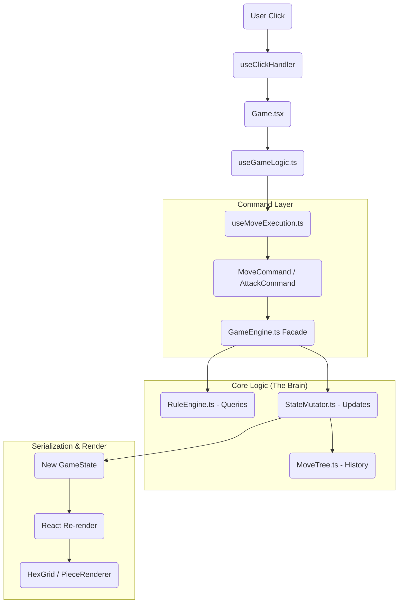

# Castles Architecture Analysis
## Living Documentation

> **Version**: 2.0 (December 2025)  
> **Purpose**: System map and architecture reference for the Castles fantasy chess game.

---

## Table of Contents
1. [Overview](#overview)
2. [Control Flow Mapping](#1-control-flow-mapping)
3. [Data Serialization (PGN)](#2-data-serialization-pgn)
4. [Hook Composition](#3-hook-composition)
5. [Extension Test: Adding a New Piece](#4-extension-test-adding-a-new-piece)
6. [MoveTree Structure](#5-movetree-structure)
7. [Modes](#6-modes)
8. [God Object Analysis](#7-god-object-analysis)
9. [Key Files Reference](#8-key-files-reference)
10. [Refactoring Roadmap](#9-refactoring-roadmap)

---

## Overview

This document describes how the core systems work together in the Castles game.

### Architecture Strengths

| Pattern | Implementation | Benefit |
|---------|----------------|---------|
| **Facade** | `GameEngine` delegates to `RuleEngine` + `StateMutator` | Clean API, testable subsystems |
| **Strategy** | `MoveStrategyRegistry`, `AttackStrategyRegistry` | Easy to add new piece types |
| **Command** | `MoveCommand`, `AttackCommand`, etc. | Encapsulated actions, undo potential |
| **Immutability** | `Piece.with()` method, readonly properties | Safe state transitions |
| **O(1) Lookups** | `PieceMap`, `Set<string>` for hexes | Fast validation |

---

## 1. Control Flow Mapping

### User Action Lifecycle

The path of a user interaction (e.g., clicking a hex to move a piece):



### Input Handler Mapping

| Input | Handler | Target Function |
|-------|---------|----------------|
| Arrow Keys | `useInputHandler.ts` | `stepHistory` (via `onNavigate`) |
| Hex Click | `useClickHandler.ts` | `handleHexClick` |
| Piece Click | `PieceRenderer.tsx` | `handlePieceClick` |
| Pass Button | `ControlPanel.tsx` | `handlePass` |
| Escape Key | `useInputHandler.ts` | Clear selection |

### Key Components

| Layer | Component | Responsibility |
|-------|-----------|----------------|
| **Input** | `useInputHandler.ts`, `useClickHandler.ts` | Keyboard and mouse handling |
| **View** | `useGameView.ts` | UI-only state (coordinates, rotation) |
| **Controller** | `useGameLogic.ts` | Composes Core, Analysis, PGN hooks |
| **Actions** | `useMoveExecution.ts` | Command execution |
| **Model** | `useCoreGame.ts` | Strict Game State and Engine instance |
| **Logic Core** | `GameEngine.ts` | Facade delegating to RuleEngine (Read) and StateMutator (Write) |
| **Data Model** | `Board`, `Piece`, `Castle`, `Sanctuary` | Core domain entities |

---

## 2. Data Serialization (PGN)

The game uses a PGN-like string format for saving/loading games with full variation support.

### Export Flow

```
getPGN() in usePGN.ts
    → PGNService.generatePGN()
    → PGNGenerator
        1. Read MoveTree.rootNode.snapshot.pieces (starting position)
        2. Base64-encode CustomSetup (BoardConfig, Pieces, Castles, Sanctuaries)
        3. Recursive tree traversal for moves + variations
        4. Return PGN string
```

**CustomSetup Format**:
```
[CustomSetup "base64-encoded-json"]
```

Contains:
- `BoardConfig`: nSquares, riverCrossingLength, riverSegmentLength
- `Pieces`: Array of piece data (hex, color, type, flags)
- `Castles`: Array of castle data (hex, owner, spawnCounter)
- `Sanctuaries`: Array of sanctuary data (hex, type, pledgedBy)

### Import Flow

```
loadPGN() in usePGN.ts
    → PGNService.parsePGN()
    → PGNImporter:
        1. parsePGN() - Extract CustomSetup tag + Parse moves to skeletal tree
        2. reconstructState() - Decompress base64 → Board, Pieces, Sanctuaries
        3. hydrateRecursive() - Replay each move, attach GameState snapshots
        4. Return fully navigable GameState with populated MoveTree
```

**Hydration Detail**:
For each skeletal move node:
1. Find the piece matching the notation
2. Execute move through GameEngine
3. Attach resulting snapshot to node
4. Recurse into child variations

---

## 3. Hook Composition

The hooks form a layered architecture:

```
Game.tsx
├── useGameView()          → UI state (coordinates, rotation)
└── useGameLogic()         → Controller
    ├── useCoreGame()      → Model (state + engine)
    ├── useAnalysisMode()  → Navigation controls
    ├── usePGN()           → Import/Export
    └── useMoveExecution() → Action execution via Commands
```

### State Ownership

| State | Owner | Notes |
|-------|-------|-------|
| `pieces`, `castles`, `turnCounter` | `useCoreGame` | Core game state |
| `moveTree`, `viewNodeId` | `useCoreGame` | History navigation |
| `showCoordinates`, `isBoardRotated` | `useGameView` | UI preferences |
| `isAnalysisMode` | Passed as prop | Mode flag |

---

## 4. Extension Test: Adding a New Piece

To add a new piece type (e.g., "Champion"):

| File | Change |
|------|--------|
| [`Constants.ts`](./src/Constants.ts) | Add `Champion` to `PieceType` enum |
| [`PieceTypeConfig.ts`](./src/Classes/Config/PieceTypeConfig.ts) | Add config (Strength, AttackType, Description) |
| [`MoveStrategyRegistry.ts`](./src/Classes/Strategies/MoveStrategyRegistry.ts) | Add movement function |
| [`AttackStrategyRegistry.ts`](./src/Classes/Strategies/AttackStrategyRegistry.ts) | (Optional) If non-standard attack |
| `public/images/pieces/` | Add wChampion.svg, bChampion.svg |
| [`PieceImages.ts`](./src/components/PieceImages.ts) | Map image imports |

**Verdict**: ✅ **PASSED**. Uses Strategy Registry pattern. Core files (`Piece.ts`, `GameEngine.ts`, `RuleEngine.ts`, `StateMutator.ts`) need no modification.

---

## 5. MoveTree Structure

The `MoveTree` is a tree where:
- **Root node**: Starting position (snapshot of initial pieces)
- **Child nodes**: Moves with attached `GameState` snapshots
- **Branches**: Variations (multiple children from same parent)

```typescript
interface MoveNode {
  id: string;
  move: MoveRecord;
  parent: MoveNode | null;
  children: MoveNode[];
  selectedChildIndex: number;  // Which variation is "main line"
  snapshot?: HistoryEntry;     // State after this move
}
```

### Navigation

| State | Value | Meaning |
|-------|-------|---------|
| `viewNodeId` | `null` | Viewing live game |
| `viewNodeId` | `"abc123"` | Viewing historical position |
| `isViewingHistory` | `viewNodeId !== null` | Derived, not stored |

---

## 6. Modes

### Play Mode (`isAnalysisMode = false`)
- Normal gameplay with move indicators
- Moves advance the game state
- History viewing is read-only (no branching)

### Analysis Mode (`isAnalysisMode = true`)
- Move indicators shown even in history
- Arrow keys navigate through history
- Making moves creates variations (branches)

---

## 7. God Object Analysis

### `useGameLogic.ts` Breakdown

| Concern | Lines | Description |
|---------|-------|-------------|
| State Management | 53-77 | Core state initialization |
| Analysis Mode | 84-151 | Snapshot computation |
| Computed Values | 183-231 | Derived game values |
| Action Handlers | 252-325 | Move/attack/resign handlers |
| Export Block | 333-376 | ~30 properties exported |

**Status**: ⚠️ This hook has grown to handle multiple concerns. Consider splitting.

### Recommended Separation

| New Hook | Responsibility |
|----------|----------------|
| `useComputedGame` | Derived values (turnPhase, legalMoves, etc.) |
| `useCoreGame` | Already exists - pure state |
| `useMoveExecution` | Already exists - action execution |
| `useAnalysisMode` | Already exists - navigation |

---

## 8. Key Files Reference

| File | Purpose |
|------|---------|
| `MoveTree.ts` | Tree data structure for move history |
| `useGameLogic.ts` | Central controller composing all hooks |
| `useCoreGame.ts` | Core state and engine management |
| `useGameView.ts` | UI-only state management |
| `useAnalysisMode.ts` | History navigation controls |
| `useMoveExecution.ts` | Command execution |
| `usePGN.ts` | Import/Export functionality |
| `PGNService.ts` | Facade for PGN operations |
| `PGNImporter.ts` | Recursive tree hydration |
| `PGNGenerator.ts` | Recursive tree serialization |
| `PieceTypeConfig.ts` | Single source of truth for piece stats |
| `GameEngine.ts` | Facade for game logic |
| `RuleEngine.ts` | Query methods (legal moves, attacks) |
| `StateMutator.ts` | State transition methods |

---

## 9. Refactoring Roadmap

### Step 1: Create AbilityType Enum
Replace magic strings `"Fireball"`, `"Teleport"`, `"RaiseDead"` with:
```typescript
export enum AbilityType {
  Fireball = "Fireball",
  Teleport = "Teleport", 
  RaiseDead = "RaiseDead",
}
```

### Step 2: Add Missing Commands
Create `PledgeCommand.ts` and `AbilityCommand.ts` to complete the Command pattern.

### Step 3: Split useGameLogic
Extract `useComputedGame.ts` for derived values:
- `turnPhase`, `currentPlayer`
- `legalMoves`, `legalAttacks`
- `legalMoveSet`, `legalAttackSet`
- `victoryMessage`, `winner`

### Step 4: Unify State Computation
Currently both `getEffectiveState()` and `viewState` compute snapshots. Consolidate to single source.

### Step 5: Event Bus Integration
Use existing `gameEvents` system for decoupled side effects (sounds, animations).

---

## Command Pattern Reference

```typescript
// src/Classes/Commands/GameCommand.ts
interface GameCommand {
  readonly type: CommandType;
  execute(state: GameState): CommandResult;
  getNotation(): string;
}

enum CommandType {
  Move = "MOVE",
  Attack = "ATTACK",
  CastleAttack = "CASTLE_ATTACK",
  Pass = "PASS",
  Recruit = "RECRUIT",
  Pledge = "PLEDGE",   // To be implemented
  Ability = "ABILITY", // To be implemented
}
```

### Available Commands

| Command | Purpose |
|---------|---------|
| `MoveCommand` | Piece movement |
| `AttackCommand` | Piece combat |
| `CastleAttackCommand` | Castle capture |
| `PassCommand` | Skip phase |
| `RecruitCommand` | Spawn piece from castle |

---

## Event System Reference

| Event | When Emitted |
|-------|--------------|
| `MOVE_MADE` | After piece movement |
| `ATTACK_RESOLVED` | After combat |
| `CASTLE_CAPTURED` | Castle changes owner |
| `PIECE_RECRUITED` | New piece spawned |
| `TURN_CHANGED` | Phase/player changes |
| `PIECE_DESTROYED` | Combat death |
| `SANCTUARY_PLEDGED` | Pledge action |
| `ABILITY_ACTIVATED` | Special ability |
| `GAME_ENDED` | Game over |
