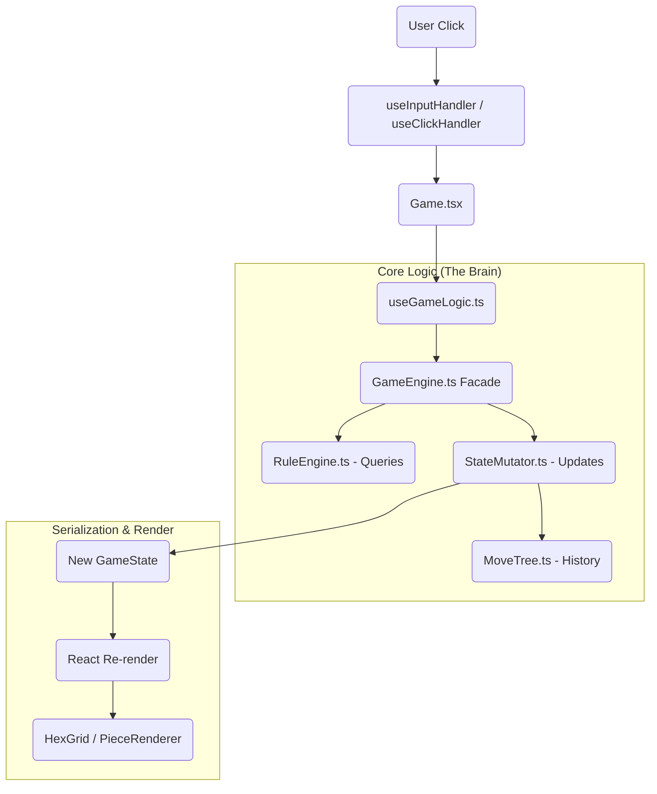

# Analysis Mode & PGN Architecture

## Overview

This document describes how Analysis Mode, Variant Creation, and PGN Import/Export work together.

> [!WARNING]
> This document has been updated to reflect the *actual* current implementation, which contains several bugs and discrepancies from the original design. See "Known Issues" below.

---

## 1. Control Flow Mapping

### User Action Lifecycle
The path of a user interaction (e.g., clicking a hex to move a piece):

### Key Components
*   **Input Layer**: `useInputHandler.ts` (Keyboard) & `useClickHandler.ts` (Mouse).
*   **Orchestrator**: `useGameLogic.ts` (God Hook). Combines UI state, Analysis state, and Game state.
*   **Logic Core**: `GameEngine.ts`. A clean Facade pattern delegating to `RuleEngine` (Read) and `StateMutator` (Write).
*   **Data Model**: `Board`, `Piece`, `Castle`, `Sanctuary`.

---

## 2. Data Serialization (PGN)

The game uses a PGN-like string format for saving/loading.

### Export Flow
`getPGN()` in `usePGN.ts` -> `PGNService.generatePGN()` -> uses `PGNGenerator`.
*   **Setup Tag**: Encodes `BoardConfig`, `Pieces`, `Castles`, `Sanctuaries`.
*   **Moves**: Recursive descent of `MoveTree` to generate standard PGN notation (e.g., `1. wSwordsman F5-F6`).

### Import Flow
`loadPGN()` -> `PGNService.parsePGN()` -> uses `PGNImporter`.
1.  **Parse Setup**: Reconstructs the exact starting board state.
2.  **Replay Moves**: **CRITICAL LIMITATION**. Currently extracts a *linear* list of moves from the Main Line, ignoring Side Variations.
3.  **Rebuild Tree**: Replays moves one-by-one to rebuild the `MoveTree` and snapshots.

---

## 3. The "God Object" Check

| Component | Status | Analysis |
| :--- | :--- | :--- |
| **`useGameLogic.ts`** | 🚨 **GOD OBJECT** | Defines **425 lines** of mixed concerns. It handles UI settings (coordinates), Analysis Mode state, PGN wrapping, Game Rules, and Sound triggers. **Result:** Extremely high coupling; changing UI logic risks breaking game rules. |
| **`Game.tsx`** | ⚠️ Bloated | Handles too much "prop drilling" and layout logic. Acts as a massive switchboard. |
| **`GameEngine.ts`** | ✅ Clean | Properly implements the Facade pattern. Delegates work to `RuleEngine` and `StateMutator`. |
| **`Board.ts`** | ✅ Clean | Pure data structure holding Hexes and Edges. |

---

## 4. The "Extension Test": Adding a New Piece

Hypothetical: Adding a "Champion" piece.

**Files Changed:**
1.  `Constants.ts`: Add `Champion` to `PieceType` enum.
2.  `PieceTypeConfig.ts`: Add config (Strength: 2, AttackType: Melee, etc.).
3.  `MoveStrategyRegistry.ts`: Add movement function (e.g., `getWalkingMoves(2)`).
4.  `AttackStrategyRegistry.ts`: (Optional) If standard Melee, no change needed.
5.  *Assets*: Add the image file.

**Verdict**: ✅ **PASSED**. The system uses `PieceTypeConfig` and Registries effectively. `Piece.ts` does not need modification.

---

## Key Files & Concepts

### MoveTree
A tree data structure storing all moves with branches (variations).

### Files
*   `MoveTree.ts`: Tree data structure.
*   `useGameLogic.ts`: Central hook (God Object).
*   `PGNService.ts`: Import/Export Facade.
*   `PieceTypeConfig.ts`: Single source of truth for Piece stats.

---

## Modes

### Play Mode (`analysisEnabled = false`)
- Normal gameplay. move indicators active.

### Analysis Mode (`analysisEnabled = true`)
- **Move Blocking**: Logic exists but `useGameLogic` controls it via `isAnalysisMode` flag.
- **Bug**: Move indicators explicitly ensuring they are HIDDEN in analysis mode in `useGameLogic.ts`.

---
