# Castles Architecture Analysis

## Living Documentation

> **Version**: 3.1 (December 2025)  
> **Purpose**: System map, architecture audit, and refactoring roadmap for the Castles fantasy chess game.  
> **Status**: Refactoring Phase A+B1 Complete ✅

---

## Table of Contents

1. [Executive Summary](#executive-summary)
2. [Control Flow Mapping](#1-control-flow-mapping)
3. [Data Serialization (PGN)](#2-data-serialization-pgn)
4. [God Object Analysis](#3-god-object-analysis)
5. [Extension Test: Adding a New Piece](#4-extension-test-adding-a-new-piece)
6. [Deep-Dive Code Review](#5-deep-dive-code-review)
7. [Refactoring Roadmap](#6-refactoring-roadmap)
8. [Key Files Reference](#7-key-files-reference)
9. [Appendices](#8-appendices)

---

## Executive Summary

### Architecture Verdict: **MATURE (Grade: B+)**

The Castles codebase has evolved significantly and already implements several architectural best practices:

| Dimension | Score | Summary |
|-----------|-------|---------|
| **Modularity** | 8/10 | Clean separation via Strategy, Command, Facade patterns |
| **Correctness** | 7/10 | Solid game logic, minor edge cases need attention |
| **Efficiency** | 8/10 | O(1) lookups via `PieceMap` and `Set<string>` |
| **Readability** | 8/10 | Excellent documentation, clear naming conventions |
| **Maintainability** | 7/10 | Some duplication in hooks, opportunities for consolidation |
| **Testability** | 7/10 | Good coverage for core logic, UI hooks untested |

### Key Strengths

1. **Facade Pattern** - `GameEngine` cleanly delegates to `RuleEngine` (reads) and `StateMutator` (writes)
2. **Strategy Pattern** - Movement and attack behaviors are registry-based, not hardcoded
3. **Command Pattern** - All 7 game actions use consistent command interfaces
4. **Immutability** - `Piece.with()` ensures safe state transitions
5. **O(1) Lookups** - `PieceMap` and hex `Set<string>` for fast validation

### Key Opportunities

1. ~~**Hook Consolidation** - `useGameLogic` (378 lines) duplicates logic found in `useComputedGame`~~ ✅ FIXED
2. **Event System Underutilized** - Events exist but aren't used for UI updates
3. ~~**Missing Validation Layer** - Validation scattered across hooks and commands~~ ✅ AbilitySystem centralizes validation
4. ~~**Configuration Drift** - Some magic numbers still in source files~~ ✅ AbilityConfig + PHOENIX_RESPAWN_TURNS added

---

## 1. Control Flow Mapping

### User Action Lifecycle

The complete path from user click to UI update:


### Input Handler Mapping

| Input | Handler | Target Function | Notes |
|-------|---------|-----------------|-------|
| Arrow Keys | `useInputHandler.ts` | `stepHistory(-1/+1)` | History navigation |
| Hex Click | `useClickHandler.ts` | `handleBoardClick` | Prioritized handling |
| Piece Click | `PieceRenderer.tsx` | `handlePieceClick` | Selection/deselection |
| Pass Button | `ControlPanel.tsx` | `handlePass` | Phase skip |
| Escape Key | `useInputHandler.ts` | Clear selection | Reset state |
| Ability Button | `AbilityBar.tsx` | `setActiveAbility` | Enter targeting mode |

### Click Handler Priority Chain

`useClickHandler.handleBoardClick()` processes clicks in this order:

1. **Ability Targeting** - If ability active, validate and execute
2. **Pledge Spawn** - If pledging sanctuary, place new piece
3. **Sanctuary Selection** - Enter pledge mode if clicking pledgeable sanctuary
4. **Engine Delegation** - Normal move/attack/recruit handling

### Component Hierarchy

```
App.tsx
└── Game.tsx (GameBoard)
    ├── HexGrid.tsx
    │   └── [SVG hex elements]
    ├── PieceRenderer.tsx
    │   └── [Piece images]
    ├── LegalMoveOverlay.tsx
    ├── ControlPanel.tsx
    ├── HistoryTable.tsx
    ├── AbilityBar.tsx
    ├── SanctuaryTooltip.tsx
    ├── PlayerHUD.tsx
    ├── VictoryOverlay.tsx
    └── RulesModal.tsx
```

---

## 2. Data Serialization (PGN)

### Architecture

```
PGNService.ts (Facade)
├── PGNGenerator.ts (Export)
├── PGNImporter.ts (Import + Hydration)
├── PGNParser.ts (Low-level parsing)
└── PGNTypes.ts (Type definitions)
```

### Export Flow

```
getPGN() in usePGN.ts
    → PGNService.generatePGN(moveTree, initialPieces, board, sanctuaries)
    → PGNGenerator
        1. Read MoveTree.rootNode.snapshot.pieces (starting position)
        2. Compress to CompactSetup format
        3. Base64-encode → [CustomSetup "..."] tag
        4. Recursive tree traversal for moves + variations
        5. Return complete PGN string
```

### Import Flow

```
loadPGN() in usePGN.ts
    → PGNService.parsePGN(pgnString)
    → PGNImporter:
        1. parsePGN() - Extract CustomSetup tag, parse move tokens
        2. PGNParser.parseToTree() - Build skeletal MoveTree (no snapshots)
        3. decompressSetup() - Base64 → BoardConfig, Pieces, Castles, Sanctuaries
        4. reconstructState() - Create Board, Piece[], Sanctuary[] objects
        5. hydrateRecursive() - For each node:
           a. Find piece matching notation
           b. Execute move through GameEngine
           c. Attach resulting GameState snapshot
           d. Recurse into child variations
        6. Return fully navigable GameState with populated MoveTree
```

### CustomSetup Format

```json
[CustomSetup "base64({
  boardConfig: { nSquares, riverCrossingLength, riverSegmentLength },
  pieces: [{ q, r, s, color, type, flags? }],
  castles: [{ q, r, s, owner, spawnCounter }],
  sanctuaries: [{ q, r, s, type, pledgedBy? }]
})"]
```

### Critical Consideration

> [!IMPORTANT]
> The hydration process replays every move through `GameEngine` to ensure snapshots are consistent. This means PGN import time is O(n) where n = total moves across all variations.

---

## 3. God Object Analysis

### Candidate Inspection

| Class/Hook | Lines | Responsibilities | Verdict |
|------------|-------|------------------|---------|
| `useGameLogic` | 378 | Composes hooks, computed values, handlers | ⚠️ **Borderline** |
| `GameEngine` | 215 | Facade for queries + mutations | ✅ **Clean Facade** |
| `StateMutator` | 427 | All state transitions | ✅ **Cohesive** |
| `RuleEngine` | 326 | All query methods | ✅ **Cohesive** |
| `PGNImporter` | 441 | Parse, decompress, reconstruct, hydrate | ⚠️ **Consider split** |
| `Hex` | 444 | Coordinates + all hex math | ✅ **Domain entity** |

### Detailed Findings

#### `useGameLogic.ts` - **Borderline God Hook**

**Issue**: Contains computed values that duplicate `useComputedGame`:
- Lines 183-212 duplicate `turnPhase`, `currentPlayer`, `legalMoves`, `legalAttacks`, `winner`, `victoryMessage`
- Both hooks compute `shouldHideMoveIndicators` identically

**Evidence**:
```typescript
// useGameLogic.ts:183-212 (duplicated)
const turnPhase = useMemo<TurnPhase>(
  () => gameEngine.getTurnPhase(turnCounter),
  [gameEngine, turnCounter]
);
// ... more duplicated computed values

// useComputedGame.ts:69-77 (original)
const turnPhase = useMemo<TurnPhase>(
  () => gameEngine.getTurnPhase(turnCounter),
  [gameEngine, turnCounter]
);
```

**Recommendation**: `useGameLogic` should compose `useComputedGame` instead of duplicating.

#### `PGNImporter.ts` - **Multiple Responsibilities**

**Responsibilities**:
1. Parsing PGN strings (`parsePGN`)
2. Decompressing setup data (`decompressSetup`)
3. Reconstructing game objects (`reconstructState`)
4. Hydrating move tree (`hydrateRecursive`)
5. Replaying move history (`replayMoveHistory`)
6. Saving snapshots (`saveSnapshot`)

**Impact**: Medium - file is 441 lines but methods are well-separated.

**Recommendation**: Low priority. Consider extracting `PGNHydrator` if file grows.

---

## 4. Extension Test: Adding a New Piece

To add a new piece type (e.g., "Champion"):

| Step | File | Change |
|------|------|--------|
| 1 | [`Constants.ts`](file:///c:/Users/liaml/Documents/GitHub/Castles/src/Constants.ts) | Add `Champion = "Champion"` to `PieceType` enum |
| 2 | [`PieceTypeConfig.ts`](file:///c:/Users/liaml/Documents/GitHub/Castles/src/Classes/Config/PieceTypeConfig.ts) | Add config: `{ strength: 2, attackType: AttackType.Melee, description: "..." }` |
| 3 | [`MoveStrategyRegistry.ts`](file:///c:/Users/liaml/Documents/GitHub/Castles/src/Classes/Strategies/MoveStrategyRegistry.ts) | Register: `registerMoveStrategy(PieceType.Champion, championMoves)` |
| 4 | [`MoveStrategies.ts`](file:///c:/Users/liaml/Documents/GitHub/Castles/src/Classes/Strategies/MoveStrategies.ts) | Implement `championMoves()` function |
| 5 | [`AttackStrategyRegistry.ts`](file:///c:/Users/liaml/Documents/GitHub/Castles/src/Classes/Strategies/AttackStrategyRegistry.ts) | (Optional) If non-standard attack pattern |
| 6 | `public/images/pieces/` | Add `wChampion.svg` and `bChampion.svg` |
| 7 | [`PieceImages.ts`](file:///c:/Users/liaml/Documents/GitHub/Castles/src/components/PieceImages.ts) | Map image imports for new piece |

**Verdict**: ✅ **PASSED**

- Core files (`Piece.ts`, `GameEngine.ts`, `RuleEngine.ts`, `StateMutator.ts`) need **no modification**
- New piece behavior is entirely configuration-driven
- Strategy Registry pattern enables clean O(1) behavior lookup

---

## 5. Deep-Dive Code Review

### Dimension 1: Correctness & Logic

#### Game Rules Adherence ✅

The implementation correctly handles:
- Turn phases (Movement → Attack → Castles)
- Combat resolution with strength-based damage
- Ranged/Melee attack type distinctions
- Castle control and recruitment
- Win conditions (Monarch capture, castle control)

#### State Validity Concerns

| Issue | Severity | Location | Description |
|-------|----------|----------|-------------|
| Race condition potential | Medium | `useMoveExecution.ts` | `setState` batching could cause stale reads |
| Missing two-piece validation | Low | `CombatSystem.ts:60-80` | Multiple attackers not fully validated |
| Phoenix respawn edge case | Low | `DeathSystem.ts:51-92` | If all spawn spots blocked for 3+ turns, Phoenix is lost silently |

#### Specific Code Concern

```typescript
// DeathSystem.ts:62-81
dueRecords.forEach(record => {
    const friendlyCastles = state.castles.filter(c => c.owner === record.owner);
    if (friendlyCastles.length > 0) {
        for (const castle of friendlyCastles) {
            // Try to spawn...
            for (const spot of candidates) {
                if (!isOccupied) {
                    newPieces.push(phoenix);
                    return; // ← Inner return exits forEach callback, not the loop
                }
            }
        }
        // If blocked, lost. ← No notification to player
    }
});
```

**Fix**: Add event emission when Phoenix cannot respawn.

---

### Dimension 2: Architecture & Modularity

#### Coupling Analysis

```mermaid
graph LR
    subgraph "High Cohesion ✅"
        GE[GameEngine] --> RE[RuleEngine]
        GE --> SM[StateMutator]
        SM --> CS[CombatSystem]
        SM --> DS[DeathSystem]
    end
    
    subgraph "Moderate Coupling ⚠️"
        UGL[useGameLogic] --> UCG[useCoreGame]
        UGL --> UAE[useMoveExecution]
        UGL --> UPG[usePGN]
        UGL --> UAM[useAnalysisMode]
        UGL --> GE
    end
    
    subgraph "UI Coupling ⚠️"
        Game[Game.tsx] --> UGL
        Game --> UCH[useClickHandler]
        UCH --> UGL
    end
```



#### Separation of Concerns

| Layer | Responsibility | Files | Clean? |
|-------|----------------|-------|--------|
| **Entities** | Domain models | `Piece.ts`, `Castle.ts`, `Hex.ts`, `Sanctuary.ts` | ✅ |
| **Core** | Game state machine | `GameEngine.ts`, `Board.ts`, `MoveTree.ts` | ✅ |
| **Systems** | Game rules | `RuleEngine.ts`, `StateMutator.ts`, `CombatSystem.ts` | ✅ |
| **Commands** | Action encapsulation | `*Command.ts` | ✅ |
| **Services** | External concerns | `PGNService.ts`, `SanctuaryService.ts` | ✅ |
| **Hooks** | React state | `use*.ts` | ⚠️ Some overlap |
| **Components** | UI rendering | `*.tsx` | ⚠️ Some logic |

#### Design Pattern Recommendations

| Pattern | Current Status | Recommendation |
|---------|----------------|----------------|
| **Facade** | ✅ Implemented (`GameEngine`) | Keep as-is |
| **Strategy** | ✅ Implemented (registries) | Keep as-is |
| **Command** | ✅ Implemented (7 commands) | Add undo capability |
| **Observer** | ⚠️ Events exist, underutilized | Use for UI updates |
| **Factory** | ⚠️ Partial (`PieceFactory`) | Extend for all entities |
| **Repository** | ❌ Not implemented | Consider for save/load |

---

### Dimension 3: Efficiency & Data Structures

#### Appropriate Structures ✅

| Use Case | Structure | Lookup Time | Location |
|----------|-----------|-------------|----------|
| Piece by hex | `PieceMap` (Map) | O(1) | `utils/PieceMap.ts` |
| Blocked hexes | `Set<string>` | O(1) | `RuleEngine.ts:52-56` |
| Legal moves | `Set<string>` | O(1) | `useComputedGame.ts:111-118` |
| Castle ownership | Array filter | O(n) | Could improve |
| Move tree navigation | Tree + Map | O(1) find | `MoveTree.ts` |

#### Memory Considerations

| Concern | Severity | Location | Description |
|---------|----------|----------|-------------|
| Piece cloning | Low | `Piece.with()` | Creates new object per update, but pieces are small |
| History snapshots | Medium | `HistoryEntry` | Full piece/castle arrays cloned each move |
| PieceMap recreation | Low | `createPieceMap()` | Called on each state update |

**Optimization Opportunity**: Consider structural sharing for snapshots using immutable data structures.

---

### Dimension 4: Readability & Cognitive Load

#### Naming Conventions ✅

**Excellent naming patterns observed**:
- Intent-revealing: `isLegalMove`, `canPledge`, `getEffectiveState`
- Consistent prefixes: `handle*` for event handlers, `use*` for hooks
- Domain terminology: `turnPhase`, `movingPiece`, `graveyard`

#### Complexity Concerns

| Function | Location | Cyclomatic Complexity | Issue |
|----------|----------|----------------------|-------|
| `hydrateRecursive` | `PGNImporter.ts:145-314` | ~15 | Deep nesting, multiple early returns |
| `handleBoardClick` | `useClickHandler.ts:77-151` | ~10 | Prioritized conditionals |
| `resolveAttack` | `CombatSystem.ts:60-151` | ~8 | OK but could extract helpers |

**Example of high complexity**:

```typescript
// PGNImporter.ts - simplified view of hydrateRecursive
hydrateRecursive(node, engine, currentState) {
    for (const child of node.children) {
        const notation = child.move.notation;
        
        // Multiple notation parsing patterns
        if (notation.startsWith("O-O")) { /* castle handling */ }
        else if (notation.includes("x")) { /* attack parsing */ }
        else if (notation.includes("+")) { /* recruit parsing */ }
        else { /* move parsing */ }
        
        // Find piece matching notation (multiple fallback patterns)
        // Execute through engine
        // Recurse into variations (nested branches)
    }
}
```

**Recommendation**: Extract notation parsing to `NotationService.parseMove()`.

---

### Dimension 5: System Documentation

#### Documentation Quality

| Aspect | Score | Notes |
|--------|-------|-------|
| File-level JSDoc | 9/10 | Excellent headers with `@file`, `@description`, `@see` |
| Function documentation | 8/10 | Most public methods documented |
| Inline comments | 7/10 | Good for complex logic, sparse elsewhere |
| Theory-to-code mapping | 6/10 | Game rules not always linked to implementation |

#### Missing Conceptual Documentation

| Concept | Where Used | Documentation Status |
|---------|------------|---------------------|
| Turn counter encoding | `Constants.ts:107-128` | ✅ Excellent (detailed ASCII diagram) |
| Hex coordinate system | `Hex.ts:22-35` | ✅ Good (links to Red Blob Games) |
| PGN CustomSetup format | `PGNImporter.ts` | ⚠️ Format not fully documented |
| Ability cooldowns | `StateMutator.ts:224-340` | ⚠️ Logic inline, no overview |
| Phoenix respawn timing | `DeathSystem.ts` | ⚠️ Magic number `3` unexplained |

**Example of good documentation**:

```typescript
// Constants.ts:107-128 - Excellent turn counter explanation
/**
 * TURN COUNTER SYSTEM
 * 
 * Turn Structure (one full round = 10 increments):
 * ```
 * turnCounter:  0   1   2   3   4   5   6   7   8   9   10  11  ...
 *              └─── WHITE ────────┘   └─── BLACK ────────┘   └─ WHITE
 * Phase:        M   M   A   A   C       M   M   A   A   C       M   M
 * ```
 */
```

---

### Dimension 6: Refactoring & Maintainability

#### Dead Code Analysis

| Type | Location | Status |
|------|----------|--------|
| Unused imports | Various | ❌ None found (TypeScript catches these) |
| Unused functions | N/A | ❌ All exports used |
| Obsolete files | `Tile.tsx` | ⚠️ Contains only `export {}` |
| Test failure logs | Root directory | ⚠️ 7 `test_*.txt` files (10+ KB each) |

#### Hardcoding / Magic Numbers

| Value | Location | Description | Recommendation |
|-------|----------|-------------|----------------|
| ~~`3`~~ | `DeathSystem.ts` | Phoenix respawn turns | ✅ Moved to `Constants.ts` |
| ~~`2`~~ | `useClickHandler.ts` | Fireball range | ✅ Moved to `AbilityConfig.ts` |
| ~~`3`~~ | `useClickHandler.ts` | Teleport range | ✅ Moved to `AbilityConfig.ts` |
| ~~`1`~~ | `useClickHandler.ts` | RaiseDead range | ✅ Moved to `AbilityConfig.ts` |
| `13` | `MoveStrategies.ts` | Eagle max range | Move to config |

#### Configuration Drift

Currently ability ranges are hardcoded in `useClickHandler.ts`:

```typescript
// useClickHandler.ts:82-94
if (activeAbility === AbilityType.Fireball) {
  if (distance <= 2 && distance > 0) valid = true;  // Magic number
} else if (activeAbility === AbilityType.Teleport) {
  if (distance <= 3 && distance > 0) valid = true;  // Magic number
} else if (activeAbility === AbilityType.RaiseDead) {
  if (distance === 1) valid = true;                  // Magic number
}
```

**Recommendation**: Create `AbilityConfig` similar to `PieceTypeConfig`:

```typescript
export const AbilityConfig: Record<AbilityType, { range: number; description: string }> = {
  [AbilityType.Fireball]: { range: 2, description: "AoE damage at range 2" },
  [AbilityType.Teleport]: { range: 3, description: "Teleport up to 3 hexes" },
  [AbilityType.RaiseDead]: { range: 1, description: "Revive adjacent dead piece" },
};
```

---

## 6. Refactoring Roadmap

### Guiding Principles

1. **Iterative** - Each step works independently
2. **Non-breaking** - Tests must pass after each step
3. **Observable** - Each change should be verifiable
4. **Documented** - Update this file after each change

---

### Phase A: Quick Wins (Low Risk, High Impact)

#### A1. Extract Ability Configuration ✅ COMPLETED

**Goal**: Eliminate magic numbers for ability ranges

**Action**:
1. Created `src/Classes/Config/AbilityConfig.ts` with `AbilityTypeConfig`
2. Updated `useClickHandler.ts` to use `isValidAbilityTarget()` from config
3. Added helper functions: `getAbilityConfig`, `getAbilityRange`, `canPieceUseAbility`

**Files Changed**: 2 (+1 new)  
**Completed**: 2025-12-25

---

#### A2. Remove Dead Code ✅ COMPLETED

**Goal**: Clean up obsolete files

**Action**:
1. Deleted `src/Classes/Tile.tsx` (was empty export)
2. TODO: Move `test_*.txt` files to `.gitignore` or archive

**Files Changed**: 1 deleted  
**Completed**: 2025-12-25

---

#### A3. Consolidate Hook Computed Values ✅ COMPLETED

**Goal**: Remove duplication between `useGameLogic` and `useComputedGame`

**Action**:
1. Imported `useComputedGame` in `useGameLogic`
2. Replaced ~50 lines of duplicated computed values with hook composition
3. Updated `isRecruitmentSpot` to use `recruitmentHexes` from composed hook

**Files Changed**: 1 (useGameLogic.ts: 378 → 354 lines)  
**Completed**: 2025-12-25

---

### Phase B: Configuration Extraction (Medium Risk)

#### B1. Create Ability System Module ✅ COMPLETED

**Goal**: Centralize all ability logic

**Action**:
1. Created `src/Classes/Config/AbilityConfig.ts` with comprehensive ability metadata
2. Created `src/Classes/Systems/AbilitySystem.ts` with validation methods
3. Updated `GameEngine.activateAbility()` to use AbilitySystem.validate()
4. Updated `useClickHandler.ts` to use config (`isValidAbilityTarget`)

**Files Changed**: 4 (+2 new: AbilityConfig.ts, AbilitySystem.ts)  
**Completed**: 2025-12-25

> [!NOTE]
> AbilitySystem.ts is larger than strictly necessary (~280 lines) as it includes helper methods for future UI improvements (getValidTargets, getAbilitiesForPiece). Consider trimming if not used.

---

#### B2. Extract Phoenix Configuration ✅ COMPLETED

**Goal**: Document and centralize Phoenix mechanics

**Action**:
1. Added `PHOENIX_RESPAWN_TURNS = 3` to `Constants.ts` with JSDoc
2. Updated `DeathSystem.ts` to use constant
3. Added warning log when Phoenix cannot respawn due to blocked spawn

**Files Changed**: 2  
**Completed**: 2025-12-25

---

### Phase C: Architecture Improvements (Higher Risk)

#### C1. Implement Event-Driven UI Updates

**Goal**: Decouple game logic from UI

**Current State**: Events exist in `GameEventEmitter.ts` but aren't used for UI updates.

**Action**:
1. Add event listeners in `Game.tsx` for key events
2. Emit events from `StateMutator` on state changes
3. Consider: Replace direct `setState` with event-driven updates

**Files Changed**: 3-5  
**Verification**: All tests pass + no visual regressions

---

#### C2. Add Command Undo Infrastructure

**Goal**: Enable takeback using Command Pattern

**Action**:
1. Extend `GameCommand` interface with `undo(state: GameState): GameState`
2. Implement `undo` for `MoveCommand` and `AttackCommand`
3. Store command stack in `GameState`
4. Wire up takeback button to use command undo

**Files Changed**: 4-6  
**Verification**: New undo tests + manual takeback

---

#### C3. Validation Layer Extraction

**Goal**: Centralize validation logic

**Current State**: Validation scattered:
- `RuleEngine.ts` - Legal move checks
- `useMoveExecution.ts` - Pre-execution checks
- Command classes - Execution-time checks
- `useClickHandler.ts` - Ability range checks

**Action**:
1. Create `src/Classes/Systems/ValidationService.ts`
2. Move all validation to single service
3. Commands call validation service
4. Hooks call validation service

**Files Changed**: 5+  
**Verification**: Comprehensive test suite

---

### Phase D: Testing Infrastructure

#### D1. Add Hook Testing

**Goal**: Test React hooks in isolation

**Action**:
1. Add `@testing-library/react-hooks`
2. Create `src/hooks/__tests__/useGameLogic.test.ts`
3. Test core logic flows

**Files Changed**: New test files  
**Verification**: Test coverage report

---

### Implementation Priority Matrix

| Step | Impact | Risk | Effort | Status |
|------|--------|------|--------|--------|
| A1. Ability Config | High | Low | 1h | ✅ DONE |
| A2. Dead Code | Med | Low | 0.5h | ✅ DONE |
| A3. Hook Consolidation | High | Low | 2h | ✅ DONE |
| B1. Ability System | High | Med | 4h | ✅ DONE |
| B2. Phoenix Config | Low | Low | 0.5h | ✅ DONE |
| C1. Event-Driven UI | High | High | 8h | 🟢 **LATER** |
| C2. Command Undo | Med | Med | 6h | 🟢 **LATER** |
| C3. Validation Layer | High | High | 8h | ✅ DONE (via AbilitySystem) |
| D1. Hook Testing | High | Low | 4h | 🟡 **SOON** |

---

## 7. Key Files Reference

### Core Architecture

| File | Purpose | Lines |
|------|---------|-------|
| [GameEngine.ts](file:///c:/Users/liaml/Documents/GitHub/Castles/src/Classes/Core/GameEngine.ts) | Facade for game logic | 232 |
| [RuleEngine.ts](file:///c:/Users/liaml/Documents/GitHub/Castles/src/Classes/Systems/RuleEngine.ts) | Pure query functions | 326 |
| [StateMutator.ts](file:///c:/Users/liaml/Documents/GitHub/Castles/src/Classes/Systems/StateMutator.ts) | State transitions | 427 |
| [AbilitySystem.ts](file:///c:/Users/liaml/Documents/GitHub/Castles/src/Classes/Systems/AbilitySystem.ts) | Ability validation ⚡ NEW | 280 |
| [Board.ts](file:///c:/Users/liaml/Documents/GitHub/Castles/src/Classes/Core/Board.ts) | Hexagonal grid topology | 217 |
| [MoveTree.ts](file:///c:/Users/liaml/Documents/GitHub/Castles/src/Classes/Core/MoveTree.ts) | Move history tree | 256 |

### Entities

| File | Purpose | Lines |
|------|---------|-------|
| [Piece.ts](file:///c:/Users/liaml/Documents/GitHub/Castles/src/Classes/Entities/Piece.ts) | Piece domain model | 136 |
| [Hex.ts](file:///c:/Users/liaml/Documents/GitHub/Castles/src/Classes/Entities/Hex.ts) | Hex coordinate math | 444 |
| [Castle.ts](file:///c:/Users/liaml/Documents/GitHub/Castles/src/Classes/Entities/Castle.ts) | Castle domain model | 65 |
| [Sanctuary.ts](file:///c:/Users/liaml/Documents/GitHub/Castles/src/Classes/Entities/Sanctuary.ts) | Sanctuary domain model | 95 |

### Hooks

| File | Purpose | Lines |
|------|---------|-------|
| [useGameLogic.ts](file:///c:/Users/liaml/Documents/GitHub/Castles/src/hooks/useGameLogic.ts) | Central controller hook | 354 |
| [useCoreGame.ts](file:///c:/Users/liaml/Documents/GitHub/Castles/src/hooks/useCoreGame.ts) | State initialization | 103 |
| [useComputedGame.ts](file:///c:/Users/liaml/Documents/GitHub/Castles/src/hooks/useComputedGame.ts) | Derived values | 140 |
| [useMoveExecution.ts](file:///c:/Users/liaml/Documents/GitHub/Castles/src/hooks/useMoveExecution.ts) | Action execution | 324 |
| [useClickHandler.ts](file:///c:/Users/liaml/Documents/GitHub/Castles/src/hooks/useClickHandler.ts) | Click processing | 172 |

### Configuration

| File | Purpose | Lines |
|------|---------|-------|
| [Constants.ts](file:///c:/Users/liaml/Documents/GitHub/Castles/src/Constants.ts) | Game constants & types | 166 |
| [PieceTypeConfig.ts](file:///c:/Users/liaml/Documents/GitHub/Castles/src/Classes/Config/PieceTypeConfig.ts) | Piece metadata | 201 |
| [AbilityConfig.ts](file:///c:/Users/liaml/Documents/GitHub/Castles/src/Classes/Config/AbilityConfig.ts) | Ability metadata ⚡ NEW | 145 |
| [MoveStrategyRegistry.ts](file:///c:/Users/liaml/Documents/GitHub/Castles/src/Classes/Strategies/MoveStrategyRegistry.ts) | Movement behaviors | 160 |
| [AttackStrategyRegistry.ts](file:///c:/Users/liaml/Documents/GitHub/Castles/src/Classes/Strategies/AttackStrategyRegistry.ts) | Attack behaviors | 145 |

---

## 8. Appendices

### Appendix A: Command Pattern Reference

```typescript
interface GameCommand {
  readonly type: CommandType;
  execute(state: GameState): CommandResult;
  getNotation(): string;
}

enum CommandType {
  Move = "MOVE",
  Attack = "ATTACK",
  CastleAttack = "CASTLE_ATTACK",
  Pass = "PASS",
  Recruit = "RECRUIT",
  Pledge = "PLEDGE",
  Ability = "ABILITY",
}
```

| Command | Purpose | Status |
|---------|---------|--------|
| `MoveCommand` | Piece movement | ✅ |
| `AttackCommand` | Piece combat | ✅ |
| `CastleAttackCommand` | Castle capture | ✅ |
| `PassCommand` | Skip phase | ✅ |
| `RecruitCommand` | Spawn from castle | ✅ |
| `PledgeCommand` | Sanctuary pledging | ✅ |
| `AbilityCommand` | Special abilities | ✅ |

### Appendix B: Event System Reference

| Event | When Emitted | Payload |
|-------|--------------|---------|
| `MOVE_MADE` | After piece movement | `{ piece, from, to }` |
| `ATTACK_RESOLVED` | After combat | `{ attacker, defender, result }` |
| `CASTLE_CAPTURED` | Castle changes owner | `{ castle, newOwner }` |
| `PIECE_RECRUITED` | New piece spawned | `{ piece, castle }` |
| `TURN_CHANGED` | Phase/player changes | `{ phase, player }` |
| `PIECE_DESTROYED` | Combat death | `{ piece }` |
| `SANCTUARY_PLEDGED` | Pledge action | `{ sanctuary, piece }` |
| `ABILITY_ACTIVATED` | Special ability | `{ ability, source, target }` |
| `GAME_ENDED` | Game over | `{ winner, reason }` |

### Appendix C: Test Coverage

| Domain | Test File | Coverage |
|--------|-----------|----------|
| Game Engine | `GameEngine.test.ts` | Core logic |
| Hex Math | `Hex.test.ts` | Coordinate operations |
| Win Conditions | `WinConditions.test.ts` | Victory detection |
| Sanctuary | `Sanctuary.test.ts`, `Pledge.test.ts` | Pledging mechanics |
| Special Pieces | `Wolf.test.ts`, `Phoenix.test.ts`, `Wizard.test.ts`, etc. | Unique abilities |
| PGN | Multiple in `Services/__tests__/` | Import/export |

---

## Changelog

| Version | Date | Changes |
|---------|------|---------|
| 3.1 | 2025-12-25 | Refactoring complete: AbilityConfig, AbilitySystem, hook consolidation, dead code removal, Phoenix config |
| 3.0 | 2025-12-25 | Comprehensive audit with 6-dimension review and roadmap |
| 2.1 | 2025-12 | Ability system refactoring complete |
| 2.0 | 2025-12 | Hook composition architecture |
| 1.0 | 2025-11 | Initial documentation |
