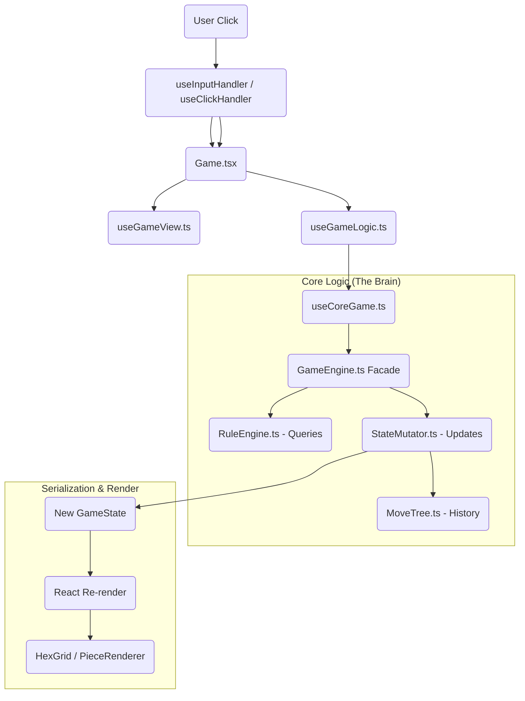

# Analysis Mode & PGN Architecture

## Overview

This document describes how Analysis Mode, Variant Creation, and PGN Import/Export work together.

> [!WARNING]
> This document has been updated to reflect the *actual* current implementation, which contains several bugs and discrepancies from the original design. See "Known Issues" below.

---

## 1. Control Flow Mapping

### User Action Lifecycle
The path of a user interaction (e.g., clicking a hex to move a piece):

### Key Components
*   **Input Layer**: `useInputHandler.ts` (Keyboard) & `useClickHandler.ts` (Mouse).
*   **View Layer**: `useGameView.ts`. Manages UI-only state (coordinates, rotation).
*   **Controller**: `useGameLogic.ts`. Composes Core Game, Analysis, and PGN hooks.
*   **Model**: `useCoreGame.ts`. Manages strict Game State and Engine instance.
*   **Logic Core**: `GameEngine.ts`. A clean Facade pattern delegating to `RuleEngine` (Read) and `StateMutator` (Write).
*   **Data Model**: `Board`, `Piece`, `Castle`, `Sanctuary`.

---

## 2. Data Serialization (PGN)

The game uses a PGN-like string format for saving/loading.

### Export Flow
`getPGN()` in `usePGN.ts` -> `PGNService.generatePGN()` -> uses `PGNGenerator`.
*   **Setup Tag**: Encodes `BoardConfig`, `Pieces`, `Castles`, `Sanctuaries`.
*   **Moves**: Recursive descent of `MoveTree` to generate standard PGN notation (e.g., `1. wSwordsman F5-F6`).

### Import Flow
`loadPGN()` -> `PGNService.parsePGN()` -> uses `PGNImporter`.
1.  **Parse Setup**: Reconstructs the exact starting board state.
1.  **Parse Setup**: Reconstructs the exact starting board state.
2.  **Hydrate Tree**: Recursively traverses the parsed `MoveTree` structure (including variations).
3.  **Snapshot Generation**: Replays move logic at each node to attach correct `GameState` snapshots to the tree.
4.  **Result**: Returns the Initial State with a fully populated, navigable `MoveTree` attached.

---

## 3. The "God Object" Check

| Component | Status | Analysis |
| :--- | :--- | :--- |
| **`useGameLogic.ts`** | 🟡 **CONTROLLER** | Refactored. Now acts as a Composition Root. UI state extracted to `useGameView`, core state to `useCoreGame`. Still handles computed view state and actions. |
| **`useGameView.ts`** | ✅ Clean | New hook handling only UI settings (coordinates, rotation). |
| **`useCoreGame.ts`** | ✅ Clean | New hook handling strict Game State and Engine instantiation. |
| **`Game.tsx`** | ⚠️ Bloated | Still handles extensive layout logic, but state management is cleaner. |
| **`GameEngine.ts`** | ✅ Clean | Properly implements the Facade pattern. Delegates work to `RuleEngine` and `StateMutator`. |
| **`Board.ts`** | ✅ Clean | Pure data structure holding Hexes and Edges. |

---

## 4. The "Extension Test": Adding a New Piece

Hypothetical: Adding a "Champion" piece.

**Files Changed:**
1.  `Constants.ts`: Add `Champion` to `PieceType` enum.
2.  `PieceTypeConfig.ts`: Add config (Strength: 2, AttackType: Melee, etc.).
3.  `MoveStrategyRegistry.ts`: Add movement function (e.g., `getWalkingMoves(2)`).
4.  `AttackStrategyRegistry.ts`: (Optional) If standard Melee, no change needed.
5.  *Assets*: Add the image file.

**Verdict**: ✅ **PASSED**. The system uses `PieceTypeConfig` and Registries effectively. `Piece.ts` does not need modification.

---

## Key Files & Concepts

### MoveTree
A tree data structure storing all moves with branches (variations).

### Files
*   `MoveTree.ts`: Tree data structure.
*   `useGameLogic.ts`: Central hook (God Object).
*   `PGNService.ts`: Import/Export Facade.
*   `PieceTypeConfig.ts`: Single source of truth for Piece stats.

---

## Modes

### Play Mode (`analysisEnabled = false`)
- Normal gameplay. move indicators active.

### Analysis Mode (`analysisEnabled = true`)
- **Move Blocking**: Logic exists but `useGameLogic` controls it via `isAnalysisMode` flag.
- **Bug**: Move indicators explicitly ensuring they are HIDDEN in analysis mode in `useGameLogic.ts`.

---
