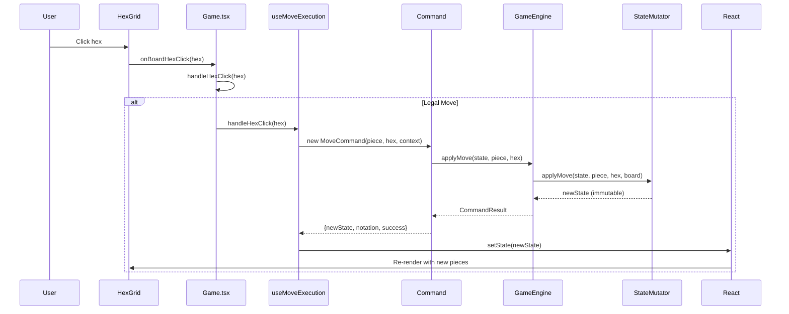
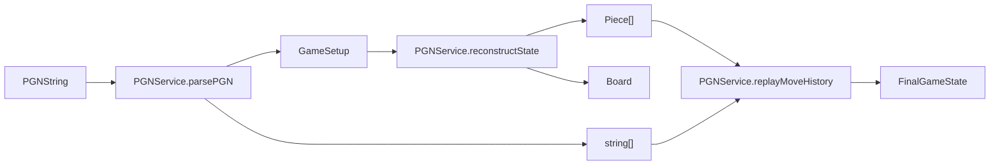

# Castles Architecture Analysis

> **Document Purpose:** A "living documentation" system map for the Castles fantasy chess game.  
> **Last Updated:** 2025-12-24

---

## Table of Contents

1. [System Overview](#1-system-overview)
2. [Control Flow Mapping](#2-control-flow-mapping)
3. [Data Serialization](#3-data-serialization)
4. [God Object Check](#4-god-object-check)
5. [Extension Test: Adding a New Piece](#5-extension-test-adding-a-new-piece)
6. [Deep-Dive Code Review](#6-deep-dive-code-review)
7. [Refactoring Roadmap](#7-refactoring-roadmap)

---

## 1. System Overview

### Architecture Pattern

The codebase follows a **layered architecture** with clear separation between:

```mermaid
graph TB
    subgraph UI Layer
        App[App.tsx]
        Game[Game.tsx]
        Components[HexGrid, HistoryTable, etc.]
    end
    
    subgraph Hook Layer
        useGameLogic[useGameLogic.ts]
        useMoveExecution[useMoveExecution.ts]
        useAnalysisMode[useAnalysisMode.ts]
    end
    
    subgraph Domain Layer
        GameEngine[GameEngine - Facade]
        RuleEngine[RuleEngine - Query]
        StateMutator[StateMutator - Mutation]
        Commands[Command Pattern]
    end
    
    subgraph Entity Layer
        Piece[Piece]
        Board[Board]
        Hex[Hex]
        Castle[Castle]
        Sanctuary[Sanctuary]
    end
    
    App --> Game
    Game --> useGameLogic
    useGameLogic --> useMoveExecution
    useGameLogic --> useAnalysisMode
    useMoveExecution --> Commands
    Commands --> GameEngine
    GameEngine --> RuleEngine
    GameEngine --> StateMutator
    RuleEngine --> Entity Layer
    StateMutator --> Entity Layer
```

### Key Directories

| Directory | Purpose | Key Files |
|-----------|---------|-----------|
| `Classes/Core` | Game state machine | `GameEngine.ts`, `Board.ts`, `MoveTree.ts`, `TurnManager.ts` |
| `Classes/Entities` | Domain objects | `Piece.ts`, `Hex.ts`, `Castle.ts`, `Sanctuary.ts` |
| `Classes/Systems` | Business logic | `RuleEngine.ts`, `StateMutator.ts`, `CombatSystem.ts` |
| `Classes/Services` | Application services | `PGNService.ts`, `SanctuaryService.ts` |
| `Classes/Strategies` | Strategy pattern registries | `MoveStrategyRegistry.ts`, `AttackStrategyRegistry.ts` |
| `Classes/Commands` | Command pattern | `MoveCommand.ts`, `AttackCommand.ts`, etc. |
| `hooks` | React state management | `useGameLogic.ts`, `useMoveExecution.ts` |
| `components` | UI components | `Game.tsx`, `HexGrid.tsx`, `HistoryTable.tsx` |

---

## 2. Control Flow Mapping

### 2.1 User Click → State Update → Re-render



### 2.2 Keyboard Navigation (Left Arrow)

Traced in [ARCHITECTURE.md](file:///c:/Users/liaml/Documents/GitHub/Castles/info/ARCHITECTURE.md):

1. `useInputHandler.ts` captures `ArrowLeft` keydown
2. Calls `onNavigate(-1)` which maps to `stepHistory(-1)` 
3. `useAnalysisMode.ts` updates `viewNodeId`
4. `useGameLogic.ts` derives `viewState` from history
5. React re-renders with historical snapshot

### 2.3 Turn Phase System

The turn counter encodes both player and phase:

```
turnCounter:  0   1   2   3   4   5   6   7   8   9   10  ...
             └─── WHITE ────────┘   └─── BLACK ────────┘
Phase:        M   M   A   A   C       M   M   A   A   C
```

- `M` = Movement phase (2 moves per turn)
- `A` = Attack phase (2 attacks per turn)
- `C` = Castles phase (recruitment)

Formula: `currentPlayer = (turnCounter % 10) < 5 ? 'w' : 'b'`

---

## 3. Data Serialization

### 3.1 PGN Export Flow

```mermaid
flowchart LR
    GameState --> PGNService.generatePGN
    PGNService.generatePGN --> CompactSetup["GameSetup (compressed)"]
    CompactSetup --> Base64["Base64 encoded JSON"]
    Base64 --> PGNHeader["[Setup \"...\"]"]
    MoveHistory --> PGNMoves["1. Sw(0,1,-1)-(0,0,0) ..."]
    PGNHeader --> PGNString
    PGNMoves --> PGNString
```

**Key Methods:**
- [PGNService.generatePGN()](file:///c:/Users/liaml/Documents/GitHub/Castles/src/Classes/Services/PGNService.ts#L32-L109): Creates full PGN string
- [PGNService.compressSetup()](file:///c:/Users/liaml/Documents/GitHub/Castles/src/Classes/Services/PGNService.ts#L223-L239): Minimizes setup JSON

### 3.2 PGN Import Flow



**Key Methods:**
- [PGNService.parsePGN()](file:///c:/Users/liaml/Documents/GitHub/Castles/src/Classes/Services/PGNService.ts#L168-L222): Extracts setup and moves
- [PGNService.reconstructState()](file:///c:/Users/liaml/Documents/GitHub/Castles/src/Classes/Services/PGNService.ts#L273-L294): Rebuilds board/pieces from setup
- [PGNService.replayMoveHistory()](file:///c:/Users/liaml/Documents/GitHub/Castles/src/Classes/Services/PGNService.ts#L296-L458): Replays moves to rebuild full state

### 3.3 Notation Format

Castles uses custom notation: `PieceType(q,r,s)-(targetQ,targetR,targetS)`

Examples:
- `Sw(0,1,-1)-(0,0,0)` - Swordsman moves
- `Ar(2,3,-5)x(-1,2,-1)` - Archer captures
- `Pass` - Turn passed
- `@Cov(2,4,-6)` - Pledge to Wolf Covenant

---

## 4. God Object Check

### 4.1 Verdict: ✅ No Major God Objects

The codebase has been refactored to avoid god objects. Responsibilities are well-distributed:

| Class | Responsibility | Lines | Status |
|-------|---------------|-------|--------|
| `GameEngine` | Facade only, delegates all work | 214 | ✅ Thin |
| `Board` | Topology only, no game logic | 217 | ✅ Focused |
| `RuleEngine` | Pure query functions | 326 | ✅ SRP |
| `StateMutator` | Pure state transitions | 426 | ⚠️ Large but focused |
| `Piece` | Entity + strategy delegation | 136 | ✅ Clean |

### 4.2 Potential Concerns

| File | Lines | Issue | Recommendation |
|------|-------|-------|----------------|
| [PGNService.ts](file:///c:/Users/liaml/Documents/GitHub/Castles/src/Classes/Services/PGNService.ts) | 480 | Handles parse, generate, AND replay | Consider splitting into `PGNParser`, `PGNGenerator`, `PGNReplayer` |
| [Game.tsx](file:///c:/Users/liaml/Documents/GitHub/Castles/src/components/Game.tsx) | 404 | Component + click handling + state orchestration | Further extract click handling to hook |
| [useGameLogic.ts](file:///c:/Users/liaml/Documents/GitHub/Castles/src/hooks/useGameLogic.ts) | 425 | Main hook, but already composed | ✅ Already uses hook composition |
| [useMoveExecution.ts](file:///c:/Users/liaml/Documents/GitHub/Castles/src/hooks/useMoveExecution.ts) | 350 | All move types in one hook | Could split by action type |

---

## 5. Extension Test: Adding a New Piece

### Files That Change (4 files only)

The Strategy Registry pattern minimizes the touch points:

| File | Change Required |
|------|-----------------|
| [Constants.ts](file:///c:/Users/liaml/Documents/GitHub/Castles/src/Constants.ts) | Add to `PieceType` enum |
| [PieceTypeConfig.ts](file:///c:/Users/liaml/Documents/GitHub/Castles/src/Classes/Config/PieceTypeConfig.ts) | Add config entry (strength, attackType, description) |
| [MoveStrategyRegistry.ts](file:///c:/Users/liaml/Documents/GitHub/Castles/src/Classes/Strategies/MoveStrategyRegistry.ts) | Register movement strategy |
| [AttackStrategyRegistry.ts](file:///c:/Users/liaml/Documents/GitHub/Castles/src/Classes/Strategies/AttackStrategyRegistry.ts) | Register attack strategy |

### Example: Adding a "Champion" Piece

```typescript
// 1. Constants.ts
export enum PieceType {
  // ... existing
  Champion = "Champion",
}

// 2. PieceTypeConfig.ts
[PieceType.Champion]: {
  strength: 2,
  attackType: AttackType.Melee,
  description: "Walks up to 2 hexes. Attacks adjacent. Strength 2.",
},

// 3. MoveStrategyRegistry.ts
registerMoveStrategy(PieceType.Champion, (hex, blocked, valid) => 
  getWalkingMoves(hex, blocked, valid, 2)
);

// 4. AttackStrategyRegistry.ts
// Already registered for AttackType.Melee!
```

### What Does NOT Change

- ✅ `Piece.ts` - Uses registry pattern
- ✅ `RuleEngine.ts` - Delegates to piece methods
- ✅ `StateMutator.ts` - Generic piece handling
- ✅ `GameEngine.ts` - No piece-specific logic
- ✅ `PGNService.ts` - Uses PieceType enum dynamically

---

## 6. Deep-Dive Code Review

### 6.1 Correctness & Logic

| Area | Status | Details |
|------|--------|---------|
| **Game Rules** | ✅ | Turn phase system correctly implemented in [TurnManager.ts](file:///c:/Users/liaml/Documents/GitHub/Castles/src/Classes/Core/TurnManager.ts) |
| **State Validity** | ✅ | Immutable state pattern prevents invalid states; `PieceMap` provides O(1) collision detection |
| **Win Conditions** | ✅ | [WinCondition.ts](file:///c:/Users/liaml/Documents/GitHub/Castles/src/Classes/Systems/WinCondition.ts) handles monarch death and castle capture |
| **Combat System** | ✅ | [CombatSystem.ts](file:///c:/Users/liaml/Documents/GitHub/Castles/src/Classes/Systems/CombatSystem.ts) correctly calculates strength with defenders/healers |

**Potential Issues:**
- No explicit validation that two pieces can't occupy same hex (relies on correct move validation)
- Race conditions unlikely due to React's synchronous setState pattern

### 6.2 Architecture & Modularity

| Pattern | Implementation | Quality |
|---------|----------------|---------|
| **Facade** | `GameEngine` | ✅ Properly delegates to `RuleEngine` and `StateMutator` |
| **Strategy** | Move/Attack registries | ✅ Excellent extensibility |
| **Command** | `MoveCommand`, `AttackCommand`, etc. | ✅ Encapsulates actions with undo potential |
| **Factory** | `PieceFactory` | ✅ Centralizes piece creation |
| **Immutable State** | `Piece.with()`, spread operators | ✅ Safe state transitions |

**Coupling Issues Found:**

| Issue | Location | Severity |
|-------|----------|----------|
| UI leaks into logic | `useMoveExecution` references UI state (`viewNodeId`) | ⚠️ Medium |
| Tight hook coupling | `useGameLogic` depends on 4 composed hooks | ⚠️ Low |
| Service mixing | `PGNService` does parsing AND state reconstruction | ⚠️ Medium |

### 6.3 Efficiency & Data Structures

| Area | Implementation | Status |
|------|----------------|--------|
| **Hex Lookup** | `Set<string>` for blocked/valid hexes | ✅ O(1) |
| **Piece Lookup** | `PieceMap` with key-based access | ✅ O(1) |
| **Castle Sets** | Pre-computed `whiteCastleHexSet`, `blackCastleHexSet` | ✅ Efficient |
| **Legal Move Caching** | `useMemo` for expensive calculations | ✅ Memoized |

**Optimization Opportunities:**
- `hasAnyFutureLegalAttacks` uses early return - good "fail fast" pattern
- History snapshots are full copies - could use structural sharing for memory efficiency

### 6.4 Readability & Cognitive Load

| Metric | Assessment |
|--------|------------|
| **Naming** | ✅ Intent-based: `blockedHexSet`, `getEnemyCastleHexes`, `isViewingHistory` |
| **File Size** | ⚠️ Some files >400 lines: `PGNService.ts`, `useGameLogic.ts`, `StateMutator.ts` |
| **Cyclomatic Complexity** | ⚠️ `PGNService.replayMoveHistory()` has nested if/else chains |
| **Magic Numbers** | ✅ Constants defined: `N_SQUARES`, `PHASE_CYCLE_LENGTH`, etc. |

### 6.5 System Documentation

| Aspect | Status |
|--------|--------|
| **File Docstrings** | ✅ Most files have `@file` and `@description` JSDoc |
| **Theory-to-Code** | ✅ Turn counter system explained in `Constants.ts` |
| **Pattern Documentation** | ✅ Strategy pattern explained in registry files |
| **Missing** | ⚠️ No high-level "how to play" in code comments |

### 6.6 Refactoring & Maintainability

**Dead Code:** None detected in core files.

**Hardcoding Issues:**

| Location | Issue | Recommended Fix |
|----------|-------|-----------------|
| [Constants.ts:93](file:///c:/Users/liaml/Documents/GitHub/Castles/src/Constants.ts#L93) | `STARTING_TIME = 20 * 60` | ✅ Already configurable via GameSetup |
| Strength values | Embedded in `PieceTypeConfig` | ✅ Centralized, easy to modify |

---

## 7. Refactoring Roadmap

### Constraints
- **Iterative**: Each step must leave the game playable
- **Testable**: Each change has verification criteria
- **Backward Compatible**: No breaking changes to save files

### Step 1: Split PGNService (Low Risk)

**Goal:** Reduce `PGNService.ts` from 480 lines to three focused modules.

**Action:**
1. Create `PGNParser.ts` - Move `parsePGN()` and helper parsing functions
2. Create `PGNGenerator.ts` - Move `generatePGN()` and serialization helpers
3. Keep `PGNService.ts` as facade that re-exports both

**Documentation:** Update ARCHITECTURE.md with new service structure.

**Verification:**
- Run existing tests: `npm test -- --testPathPattern=PGN`
- Manual: Export → Import a save file, verify round-trip works

---

### Step 2: Extract Click Handler from Game.tsx (Medium Risk)

**Goal:** Decouple UI rendering from click handling logic.

**Action:**
1. Create `useClickHandler.ts` hook
2. Move `handleHexClick`, `onBoardHexClick`, sanctuary click logic
3. Game.tsx calls hook, passes results to child components

**Documentation:** Add hook to the composition diagram in ARCHITECTURE.md.

**Verification:**
- Run: `npm test`
- Manual: Click to move, attack, recruit - all should work identically

---

### Step 3: Add Event Bus for State Changes (Medium Risk)

**Goal:** Enable decoupled reactions to game state changes (for future sound effects, animations, logging).

**Action:**
1. Expand `Classes/Events/GameEvents.ts` 
2. Emit events from `StateMutator` after each state change
3. Create subscriber hook `useGameEvents.ts` for UI reactions

**Documentation:** Add event flow diagram to ARCHITECTURE.md.

**Verification:**
- Create test that subscribes to `MOVE_MADE` event
- Verify event contains correct piece and hex data

---

### Step 4: Introduce State Validation Layer (Low Risk)

**Goal:** Add explicit invariant checks to catch bugs early.

**Action:**
1. Create `StateValidator.ts` with checks for:
   - No two pieces on same hex
   - All pieces on valid hexes
   - Castle ownership matches controller
2. Run validator in development mode after each `setState`

**Verification:**
- Write unit tests for each invariant
- Run full game, confirm no validation failures

---

### Step 5: Add Undo/Redo Support (High Complexity)

**Goal:** Leverage Command pattern to enable move reversal.

**Action:**
1. Add `undo()` method to each Command class
2. Create `UndoManager` to track command stack
3. Wire to keyboard shortcuts (Ctrl+Z, Ctrl+Y)

**Documentation:** Document undo mechanics in ARCHITECTURE.md.

**Verification:**
- Unit test: Execute move, undo, verify state matches original
- Manual: Play moves, undo, verify board state

---

## Appendix: File Size Report

| File | Lines | Notes |
|------|-------|-------|
| `PGNService.ts` | 90 | ✅ Refactored to facade |
| `PGNGenerator.ts` | 175 | NEW - Export logic |
| `PGNImporter.ts` | 305 | NEW - Import logic |
| `PGNTypes.ts` | 35 | NEW - Shared types |
| `useGameLogic.ts` | 425 | Already composed |
| `StateMutator.ts` | 426 | Large but focused |
| `Game.tsx` | 404 | Extract click handling |
| `RuleEngine.ts` | 326 | Clean |
| `useMoveExecution.ts` | 350 | Could split by action type |

---

## Appendix: Test Coverage Map

| Area | Test File | Covered |
|------|-----------|---------|
| Game Engine | `GameEngine.test.ts` | ✅ |
| Win Conditions | `WinConditions.test.ts` | ✅ |
| Hex Math | `Hex.test.ts` | ✅ |
| Notation | `NotationService.test.ts` | ✅ |
| Pledging | `Pledge.test.ts` | ✅ |
| History Navigation | `useGameLogicVariants.test.ts` | ✅ |
| Special Units | `Wolf.test.ts`, `Wizard.test.ts`, etc. | ✅ |

**Missing Coverage:**
- PGN round-trip tests (export → import → verify)
- End-to-end UI flow tests
